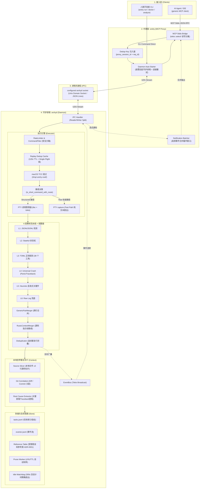
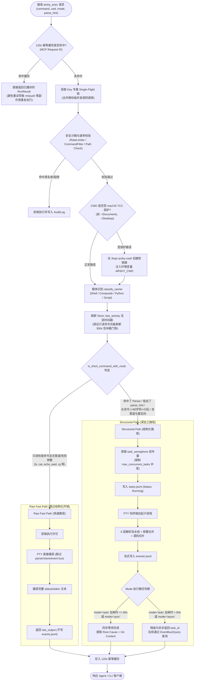
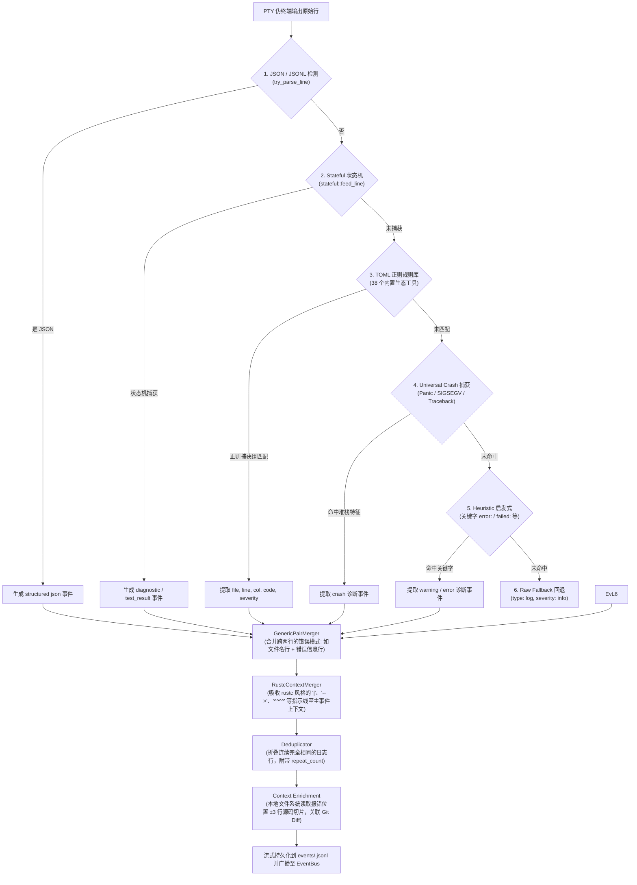
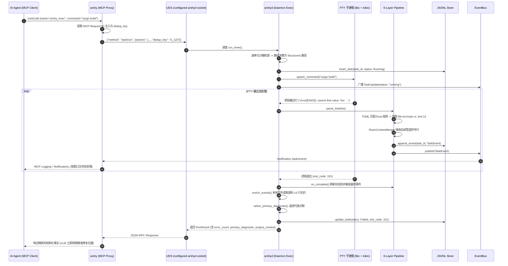
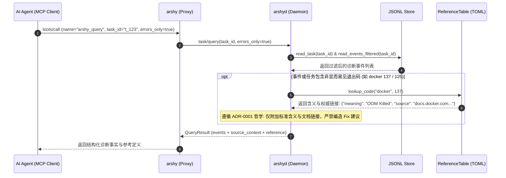
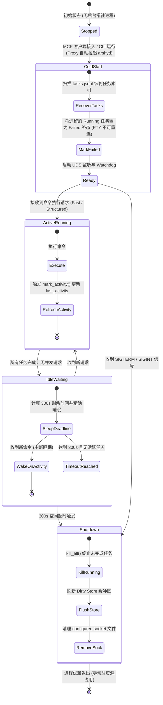

# arshy 宏观架构与核心业务全景图 (全量主文档)

> 本文档将原 `temporary.md` 的全量内容完整收录至 `docs/deep-dive/` 专栏中。包含 6 组核心架构/时序/状态机 Mermaid 流程图、图文解读以及符合 VS Code 标准的工作区相对源码跳转链接。

---

## 一、 系统宏观架构与组件拓扑 (Two-Binary Architecture)

### 📖 业务逻辑与架构解读 (图一)
1. **双二进制架构（Two-Binary）**：
   - `arshy`（Proxy/CLI）：负责接收来自 Agent（Claude Code/Cursor）的标准输入输出（Stdio）JSON-RPC，完成参数检验与 `dedup_key` 注入；如果后台守护进程未启动，Proxy 负责将其按需拉起（Auto-start）。
   - `arshyd`（Daemon）：真正的常驻后台服务。管理 PTY、调度执行、流式解析、落盘 JSONL 以及 300s 无任务时自动退出。
2. **人类通道 vs Agent 通道（ADR-0003）**：人类使用 `arshy run "cargo build"` 时，直接通过 UDS 连接 Daemon 并获得色彩丰富的 Pretty UI 终端输出；Agent 则通过标准 MCP 协议通信，互不干扰。
3. **高频事件合并（Notification Batching）**：构建和测试往往瞬间产生上万行日志，Proxy 内部通过 `tokio::select!` 维护了时间窗口，将高频通知合并打包发送，防止 Agent 端 MCP 连接被泛洪打崩。

### 🔗 源码与 ADR 证据链
- **Proxy 事件循环与 Stdio 桥接**：[src/proxy/mod.rs:L100](../../src/proxy/mod.rs#L100) (第 100-220 行)
- **守护进程自动按需拉起与退避重连**：[src/proxy/connection.rs](../../src/proxy/connection.rs)
- **Daemon IPC 读写分离处理器**：[src/daemon/ipc_handler/mod.rs:L70](../../src/daemon/ipc_handler/mod.rs#L70) (第 70-120 行)
- **人类 CLI 直连实现**：[src/cli/mod.rs](../../src/cli/mod.rs) 与 [src/cli/render.rs](../../src/cli/render.rs)
- **架构决策依据**：[ADR-0003 (AI-Native 定位与人类通道)](../decisions/0003-ai-native-positioning-and-platform.md)、[ADR-0007 (数据驱动与按需 Daemon)](../decisions/0007-data-driven-execution-and-on-demand-daemon.md)

---

## 二、 命令执行路径与决策流 (Execution Path Decision Flow)

### 📖 业务逻辑与决策解读 (图二)
1. **重放幂等与 Single-Flight 防击穿（ADR-0004）**：Agent 在网络抖动重试时，相同 MCP Request ID 会命中 120s 结果缓存；若多个并发请求同时到达，Single-Flight 弱引用锁会阻塞后续请求，只执行一次命令，彻底杜绝 `rm -rf` 或 `git push` 被执行两次的灾难。
2. **macOS TCC 权限适配**：macOS 对 `~/Documents`、`~/Desktop` 等目录有严格的沙盒弹窗保护。`prepare_cwd` 检测到受保护目录时，会使用 `DefaultHasher` 生成标识，在 `/tmp/.arshy-cwd/<hash>` 下创建软链接并在子进程中注入 `ARSHY_CWD`，既保证权限不报错，又让命令内部感知真实路径。
3. **Raw Fast Path vs Structured Path（ADR-0007）**：
   - **Fast 路径**：针对 `ls`, `pwd`, `cat`, `rg` 等纯只读检查命令，仍通过 Unix PTY 捕获合并后的 stdout/stderr，但跳过 parser、事件落盘和 EventBus 广播，直接返回 raw output。若带危险参数（如 `tail -f`, `sed -i`, `sort -o`）或重定向/管道，强制转入 Structured 路径。
   - **Structured 路径**：针对构建、测试或长耗时任务，受 `max_concurrent_tasks`（默认 4）信号量控制，拉起真实 PTY 捕获色彩与行缓冲输出。在 `auto` 模式下，如果 60s 内未完成，自动从阻塞同步降级为返回 `task_id` 异步流转。

### 🔗 源码与 ADR 证据链
- **120s 幂等缓存与 Single-Flight 互斥锁**：[src/daemon/exec/mod.rs:L59](../../src/daemon/exec/mod.rs#L59) (第 59-65 行及第 215-260 行)
- **macOS TCC 软链接转换逻辑**：[src/daemon/exec/cwd.rs](../../src/daemon/exec/cwd.rs)
- **载体识别分类器（Carrier）**：[src/daemon/exec/decision.rs:L106](../../src/daemon/exec/decision.rs#L106) (第 106-164 行)
- **is_short_command AST 分析与白名单**：[src/daemon/exec/decision.rs:L19](../../src/daemon/exec/decision.rs#L19) (第 19-104 行)
- **Fast 路径实现 (run_short)**：[src/daemon/exec/mod.rs:L398](../../src/daemon/exec/mod.rs#L398) (第 398-412 行)
- **Structured 路径与 60s 自动降级**：[src/daemon/exec/mod.rs:L414](../../src/daemon/exec/mod.rs#L414) (第 414-447 行)
- **架构决策依据**：[ADR-0004 (幂等重放与并发安全)](../decisions/0004-replay-idempotency-and-execution-safety.md)、[ADR-0007 (数据驱动执行路径)](../decisions/0007-data-driven-execution-and-on-demand-daemon.md)

---

## 三、 6 层解析流水线与规整架构 (The 6-Layer Parser Pipeline)

### 📖 业务逻辑与规整解读 (图三)
1. **严格分层漏斗设计（6-Layer Pipeline）**：
   - **Layer 1 (JSON)**：优先识别原生结构化日志，零正则损耗直接转为事件。
   - **Layer 2 (Stateful)**：处理跨行状态机（如 pytest 的测试收集汇总）。
   - **Layer 3 (TOML Regex)**：核心层，内置 38 个生态工具（cargo, tsc, go, pytest, docker 等），通过 TOML 声明捕获代码位置与错误码。所有正则均通过 ReDoS 静态扫描。
   - **Layer 4 (Crash)**：通用兜底，捕获 Rust Panic、Python Traceback、Go Panic、SIGSEGV 等严重崩溃。
   - **Layer 5 (Heuristic)**：关键词启发式过滤，识别 `error:`, `failed:` 等通用警告。
   - **Layer 6 (Raw Fallback)**：兜底为普通 info log。
2. **多行规整与上下文吸收（Merger & Dedup）**：
   - `RustcContextMerger`：将编译器打印的 `  |`、`  -->`、`  = note:`、`^^^^` 等辅助视觉行全部合并进主 Diagnostic 事件的 `context.after` 数组中，防止视觉噪声稀释 LLM 上下文。
   - `Deduplicator`：在构建日志泛洪时，将连续出现的重复日志行折叠，记录 `repeat_count`。

### 🔗 源码与 ADR 证据链
- **6 层解析器引擎主分发**：[src/daemon/parser/mod.rs:L265](../../src/daemon/parser/mod.rs#L265) (第 265-303 行)
- **Rustc 上下文行吸收合并器**：[src/daemon/parser/mod.rs:L345](../../src/daemon/parser/mod.rs#L345) (第 345-420 行)
- **双行模式合并器 (PairMerger)**：[src/daemon/parser/pair_merger.rs](../../src/daemon/parser/pair_merger.rs)
- **连续行重复折叠器 (Deduplicator)**：[src/daemon/parser/dedup.rs](../../src/daemon/parser/dedup.rs)
- **ReDoS 静态正则安全检查**：[src/daemon/parser/redos.rs](../../src/daemon/parser/redos.rs)
- **38 个内置生态工具 TOML 规则资产**：[parsers/builtin/](../../parsers/builtin/)
- **架构决策依据**：[ADR-0006 (注意力编译器与三层载体)](../decisions/0006-value-anchor.md)

---

## 四、 同步结构化执行端到端时序图 (End-to-End Execution Sequence)

### 📖 业务逻辑与数据流解读 (图四)
1. **真实 PTY 进程管理**：使用 Unix PTY 与 `libc`/Tokio 建立虚拟终端，保证如 `cargo` 等工具能够输出完整无死锁的行缓冲数据。如果输出超过上限，会自动执行输出截断保护，但继续 drain 管道防止子进程阻塞挂起。
2. **本地世界事实中介（Context Enrichment）**：当捕获到包含 `file:line` 的报错事件后，Daemon 并不只返回错误文本，而是会自动读取本地磁盘对应文件的 **±3 行源码切片**，并关联当前的 **Git 未提交变更与最近 Commit**。LLM 收到响应后无需二次发起 `cat` 或 `git status` 查询即可直接开始修复。

### 🔗 源码与 ADR 证据链
- **后台任务调度与流式处理核心**：[src/daemon/exec/background.rs:L57](../../src/daemon/exec/background.rs#L57) (第 57-150 行)
- **PTY 进程创建与管道排空**：[src/daemon/exec/pty.rs](../../src/daemon/exec/pty.rs)
- **Root Cause 提取与 Python Traceback 特例**：[src/daemon/exec/enrich.rs:L1](../../src/daemon/exec/enrich.rs#L1) (第 1-60 行)
- **源码 ±3 行切片读取**：[src/daemon/context/mod.rs](../../src/daemon/context/mod.rs)
- **Git 变更与关联分析**：[src/daemon/context/git_correlator.rs](../../src/daemon/context/git_correlator.rs)

---

## 五、 诊断回溯与受限错误码查询时序 (Query & Reference Sequence)

### 📖 业务逻辑与哲学解读 (图五)
1. **去 HintDb 化与受限参考表（ADR-0001）**：项目彻底废除了过去基于规则合成修复建议（Cause/Fix/Retry）的 `HintDb`。因为**提出修复方案是 LLM 的职责，Parser 不应越俎代庖**。
2. **按需查表，永不内联**：仅针对 Docker 125/126/127/137、Kubectl、AWS 等非显而易见的系统级退出码维护权威参考表（`reference/builtin/*.toml`）。该参考表**永不写入事件持久化流**，仅在 Agent 通过 `arshy_query` 显式查询时按需附带标准释义和官方文档链接。

### 🔗 源码与 ADR 证据链
- **受限错误码参考表实现**：[src/daemon/reference/mod.rs](../../src/daemon/reference/mod.rs)
- **内置 Docker/K8s/AWS 退出码数据**：[reference/builtin/docker.toml](../../reference/builtin/docker.toml)
- **Query 处理器与参考码附加逻辑**：[src/daemon/ipc_handler/mod.rs:L250](../../src/daemon/ipc_handler/mod.rs#L250) (第 250-310 行)
- **架构决策依据**：[ADR-0001 (受限错误码参考表与去 HintDb)](../decisions/0001-restricted-reference-tables.md)

---

## 六、 守护进程生命周期与按需拉起状态机 (Lifecycle & Watchdog)

### 📖 业务逻辑与常驻优化解读 (图六)
1. **冷启动崩溃恢复（ADR-0007）**：Daemon 冷启动加载 `tasks.jsonl` 时，若发现上次异常崩溃遗留的 `Running` 状态任务，会立即将其更新为 `Failed`。因为 PTY 句柄无法跨进程重连，若保持 `Running` 会导致看门狗永久无法判定空闲。
2. **事件驱动的 300s 精确退出（Zero-Polling）**：摒弃了固定周期的计时器轮询，通过原子时间戳 `last_activity` 计算精确剩余秒数并让 Tokio 进入单次睡眠。所有命令（包括 Fast Path 快速路径）都会刷新该时间戳。
3. **安全关机与持久化保护**：进程在超时退出或收到 SIGTERM 信号时，会通过 `kill_all()` 终止所有子任务，将内存中 Dirty 的 JSONL 缓冲区安全同步至磁盘，并清理 UDS Socket 文件，实现零常驻资源消耗（Zero Resident Resource）。

### 🔗 源码与 ADR 证据链
- **Daemon 主入口与 300s 精确看门狗循环**：[src/daemon/main.rs:L180](../../src/daemon/main.rs#L180) (第 180-290 行)
- **冷启动任务索引恢复与终态置位**：[src/daemon/store/tasks.rs](../../src/daemon/store/tasks.rs)
- **Store 活跃标记与安全 Flush 机制**：[src/daemon/store/mod.rs:L94](../../src/daemon/store/mod.rs#L94) (第 94-100 行)
- **架构决策依据**：[ADR-0002 (JSONL 存储维持与触发线)](../decisions/0002-jsonl-retention-and-scale-trigger.md)、[ADR-0004 (空闲退出修复)](../decisions/0004-replay-idempotency-and-execution-safety.md)、[ADR-0007 (事件驱动 Daemon 与冷启动恢复)](../decisions/0007-data-driven-execution-and-on-demand-daemon.md)
