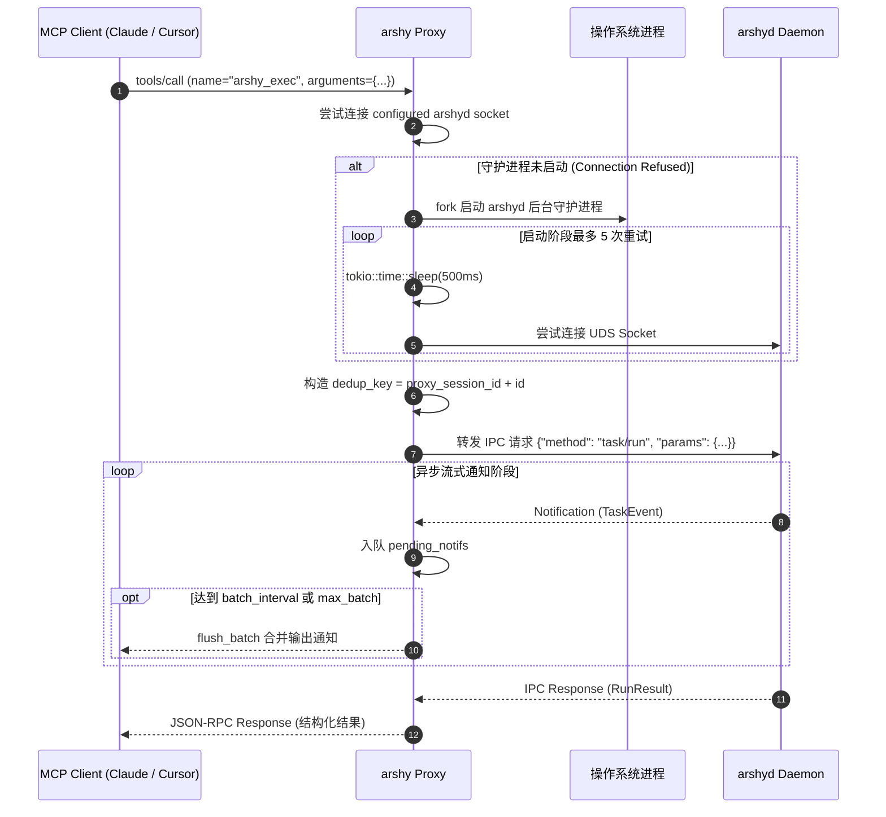

# 专题 01：代理层与 MCP 协议栈 (Proxy & MCP Subsystem)

本文深入剖析 `arshy` 的前端接入与代理层实现（`src/proxy/` 及 `src/mcp/`），涵盖 MCP Stdio 通信、多客户端会话隔离、通知合并缓冲、虚拟资源系统与自动拉起机制。

---

## 一、 代理层内部架构与数据流

```mermaid
graph TD
    subgraph StdioLoop["1. Stdio 异步循环 (tokio::select!)"]
        Stdin["stdin: JSON-RPC MCP Requests"] --> Reader["AsyncBufReadExt::read_line"]
        Reader --> StdioRouter{"Method 分发路由"}

        Writer["AsyncBufWriter: stdout"]
        BatchQueue["pending_notifs: Vec<Notification>"] --> FlushTimer{"批处理定时器 / 容量到达"}
        FlushTimer -->|flush_batch| Writer
    end

    subgraph RouterHandlers["2. 请求处理器 (handlers.rs)"]
        StdioRouter -->|initialize| HInit["handle_initialize (协商能力)"]
        StdioRouter -->|tools/list| HTools["handle_tools_list (导出 3 核心工具)"]
        StdioRouter -->|tools/call| HCall["handle_tool_call (执行 / 查询 / 控制)"]
        StdioRouter -->|resources/list| HResL["handle_resources_list (导出虚拟资源)"]
        StdioRouter -->|resources/read| HResR["handle_resources_read (读取 tasks/audit)"]
    end

    subgraph ConnMgr["3. 连接与会话管理器 (connection.rs)"]
        HCall --> InjectDedup["注入 dedup_key = proxy_session_id + req_id"]
        InjectDedup --> UDSClient["DaemonConnection (UDS Socket Client)"]
        UDSClient -->|连接失败 & auto_start=true| AutoStart["start_daemon (自动拉起 arshyd)"]
        AutoStart --> Retry["启动阶段有限重试；按需恢复使用 500/1000/2000ms 退避"]
        Retry --> UDSClient
    end

    UDSClient <-->|configured arshyd socket| Daemon["arshyd 后台守护进程"]
    Daemon -.->|流式 Notification 广播| UDSClient
    UDSClient -.->|notif_rx.recv()| BatchQueue
```

---

## 二、 核心业务逻辑与关键机制

### 1. 多 Agent 客户端会话隔离 (Proxy Session Nonce)
- **痛点**：在多 Agent 并发场景（如 Claude Code 和 Cursor 同时调用 `arshy`），两个独立的 Proxy 进程各自维护一套自增的 JSON-RPC Request ID（都是 `1, 2, 3...`）。若直接以客户端 Request ID 作为去重依据，Daemon 端的 120s 幂等去重缓存就会发生**跨会话冲突**，导致第二个客户端的第 1 条命令直接被误判为“已执行过”而返回错误结果。
- **解决方案**：每个 Proxy 进程在启动时生成专属的 UUID `proxy_session_id`。在转发 `tools/call` 时，将 `proxy_session_id` 与客户端 Request ID 拼接为全局唯一的 `dedup_key` 注入请求参数中。
- **代码位置**：[src/proxy/mod.rs:L87](../../src/proxy/mod.rs#L87) 与 [src/proxy/handlers.rs:L38](../../src/proxy/handlers.rs#L38)。

### 2. 高频事件通知合并缓冲 (Notification Batching)
- **痛点**：编译、测试等长命令在输出时往往瞬间爆发数万行日志。如果每产生一个 `TaskEvent` 就直接往 stdout 写一行 MCP Notification，极易引发 Agent 端的 I/O 阻塞甚至进程崩溃。
- **解决方案**：Proxy 内部设计了带有时间窗口与容量阈值的 Batch 队列：
  - 配置项 `notifications.batch_interval_ms`（默认时间窗口，如 50ms）与 `max_batch_events`（默认最大容量）。
  - 在 `tokio::select!` 中同时监听新事件与 `batch_deadline` 定时器，任一条件满足即触发 `flush_batch` 批量写出。
- **代码位置**：[src/proxy/mod.rs:L100-L130](../../src/proxy/mod.rs#L100) 与 [src/proxy/connection.rs](../../src/proxy/connection.rs)。

### 3. MCP Resources 虚拟资源接口
- 除了标准的 Tools 工具调用，`arshy` 还实现了只读的 MCP Resources 协议：
  - `arshy://task/{task_id}`：由 `resources/list` 从最近任务生成，读取时返回该任务的事件 JSON。
  - 安全审计日志没有暴露为 MCP Resource；它属于 daemon 本地审计边界。
- **代码位置**：[src/proxy/handlers.rs:L115-L180](../../src/proxy/handlers.rs#L115)。

### 4. 守护进程透明按需拉起 (Auto-Start & Backoff Retry)
- **机制**：启动阶段使用 5 次 500ms 间隔并带 auto-cd 校验；运行中恢复使用 3 次 500/1000/2000ms 退避。若允许自动启动，Proxy 会通过后台命令拉起 `arshyd`。
- **代码位置**：[src/proxy/connection.rs](../../src/proxy/connection.rs)。

---

## 三、 核心时序图：MCP Tool 调用与自动拉起



---

## 🔗 相关源码索引
- [src/proxy/mod.rs](../../src/proxy/mod.rs)：Proxy 主事件循环与生命周期管理
- [src/proxy/handlers.rs](../../src/proxy/handlers.rs)：MCP JSON-RPC 方法分发与处理
- [src/proxy/connection.rs](../../src/proxy/connection.rs)：UDS 连接重试、自动拉起与通知刷新
- [src/proxy/protocol.rs](../../src/proxy/protocol.rs)：MCP 协议格式化与错误结构体构建
- [src/mcp/mod.rs](../../src/mcp/mod.rs)：MCP 工具 Schema 规范定义
