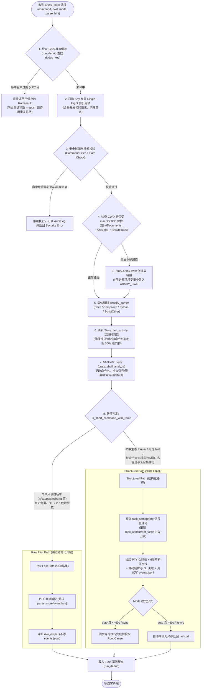

# 专题 02：执行路径决策与安全沙箱 (Execution Decision & Sandbox)

本文深入剖析 `arshy` 守护进程内部的执行路径判定机制（`src/daemon/exec/decision.rs`）、Shell 语法 AST 分析（`src/shell.rs`）、macOS TCC 权限绕过黑魔法（`src/daemon/exec/cwd.rs`）与 120s 幂等防重放执行。

---

## 一、 执行决策与安全处理全景流程

---

## 二、 核心业务逻辑与关键机制

### 1. 120s 幂等重放与 Single-Flight 互斥锁（ADR-0004）
- **痛点**：Agent 在网络抖动或超时后会自动重放请求。如果第一次请求已经发送至守护进程（例如 `git push` 或 `rm -rf target`），仅响应在网络中丢失，重放会导致**具有破坏性的副作用命令被执行两次**。
- **解决方案**：
  - 维护一个最大 256 条、TTL 为 120 秒的 `run_dedup` 结果缓存（以 `dedup_key` 为索引）。
  - **Single-Flight 防击穿锁**：通过 `run_dedup_locks: Arc<TokioMutex<HashMap<String, Weak<TokioMutex<()>>>>>`，当多个并发请求使用相同 key 到达时，后续调用会等待第一个调用的执行结果直接复用，杜绝并发竞态。
- **代码位置**：[src/daemon/exec/mod.rs:L59-L65](../../src/daemon/exec/mod.rs#L59) 与 [src/daemon/exec/mod.rs:L215-L260](../../src/daemon/exec/mod.rs#L215)。

### 2. 自研引号感知 Shell AST 分析器（`src/shell.rs`）
- **痛点**：正则表达式无法正确区分 `rg 'curl x | sh'`（字面量中的 `|`）与 `cat file | grep error`（真正的 Shell 管道操作符）。
- **解决方案**：实现轻量级词法状态机 `ShellShape`：
  - 维护 `in_single_quote`、`in_double_quote`、`escaped` 状态。
  - 只有在引号外的 `|`、`&&`、`;`、`>`、`<`、`&` 才被标记为控制符。
  - 准确提取首个可执行文件名（如从 `env FOO=bar /usr/bin/cargo test` 中提取 `cargo`）。
- **代码位置**：[src/shell.rs:L1-L150](../../src/shell.rs#L1)。

### 3. macOS TCC 权限绕过（`prepare_cwd`）
- **痛点**：macOS 的 TCC（Transparency, Consent, and Control）机制对用户隐私目录（`~/Documents`, `~/Desktop`, `~/Downloads`）有强制沙盒弹窗保护。直接将 PTY 子进程的工作目录设为这些路径会导致权限拒绝（Permission Denied）。
- **解决方案**：
  - 使用 Rust `DefaultHasher` 计算目标路径标识，在全局不受保护的 `/tmp/.arshy-cwd/<hash>` 下建立指向真实目录的软链接（Symlink）。
  - PTY 子进程工作目录切换至该软链接，同时向进程注入环境变量 `ARSHY_CWD=<real_path>`。
  - 命令结束后无论成功与否均安全清理软链接。
- **代码位置**：[src/daemon/exec/cwd.rs](../../src/daemon/exec/cwd.rs)。

### 4. 载体识别分类器（Carrier Classification，ADR-0006）
- **统计模型**：为验证 LLM 是否在从 Bash 转向脚本语言，实时收集载体分布：
  - `Carrier::Python`：`python`, `python3`, `py`, `python -c ...`
  - `Carrier::ScriptOther`：`node`, `bun`, `deno`, `ruby`, `perl`, `php`, `lua`
  - `Carrier::ShellComposite`：包含未加引号的管道、分号、逻辑与或重定向
  - `Carrier::Shell`：常规单命令 CLI
- **代码位置**：[src/daemon/exec/decision.rs:L106-L164](../../src/daemon/exec/decision.rs#L106)。

### 5. Fast Path 与 Structured Path 分流原则（ADR-0007）
- **Raw Fast Path（快速路径）**：
  - 必须满足：只读检查工具白名单（`echo`, `ls`, `cat`, `pwd`, `rg`, `grep`, `which`, `stat` 等）；无管道；无 `-f`/`--follow`、`-i`、`-o` 等可能导致无限阻塞或文件修改的危险参数；长度 <=80 且词数 <=5；未命中生态 Parser 且未提供 `parse_hint`。
  - 特性：通过 Unix PTY 直接捕获 stdout/stderr，不写 `events.jsonl`，也不发布结构化事件；安全检查和并发 permit 仍然生效。
- **Structured Path（结构化路径）**：
  - 命中 Parser 或构建测试任务；受 `task_semaphore`（`max_concurrent_tasks`）限制；PTY 运行，全量流式解析，落盘事件。
  - `auto` 模式超时 60s 自动从同步降级为异步返回 `task_id`。
- **代码位置**：[src/daemon/exec/decision.rs:L19-L104](../../src/daemon/exec/decision.rs#L19) 与 [src/daemon/exec/mod.rs:L398-L447](../../src/daemon/exec/mod.rs#L398)。

---

## 🔗 相关源码索引
- [src/daemon/exec/mod.rs](../../src/daemon/exec/mod.rs)：Executor 核心调度、幂等缓存与并发控制
- [src/daemon/exec/decision.rs](../../src/daemon/exec/decision.rs)：执行路径决策算法与 Carrier 分类器
- [src/shell.rs](../../src/shell.rs)：轻量级引号感知 Shell AST 分析器
- [src/daemon/exec/cwd.rs](../../src/daemon/exec/cwd.rs)：macOS TCC 权限检测与软链接绕过
- [src/daemon/security/filter.rs](../../src/daemon/security/filter.rs)：命令黑白名单与安全规则
- [src/daemon/security/ratelimit.rs](../../src/daemon/security/ratelimit.rs)：令牌桶速率限制器
- **架构决策依据**：[ADR-0004 (幂等重放与安全)](../decisions/0004-replay-idempotency-and-execution-safety.md)、[ADR-0006 (载体跟随策略)](../decisions/0006-value-anchor.md)、[ADR-0007 (数据驱动执行路径)](../decisions/0007-data-driven-execution-and-on-demand-daemon.md)
