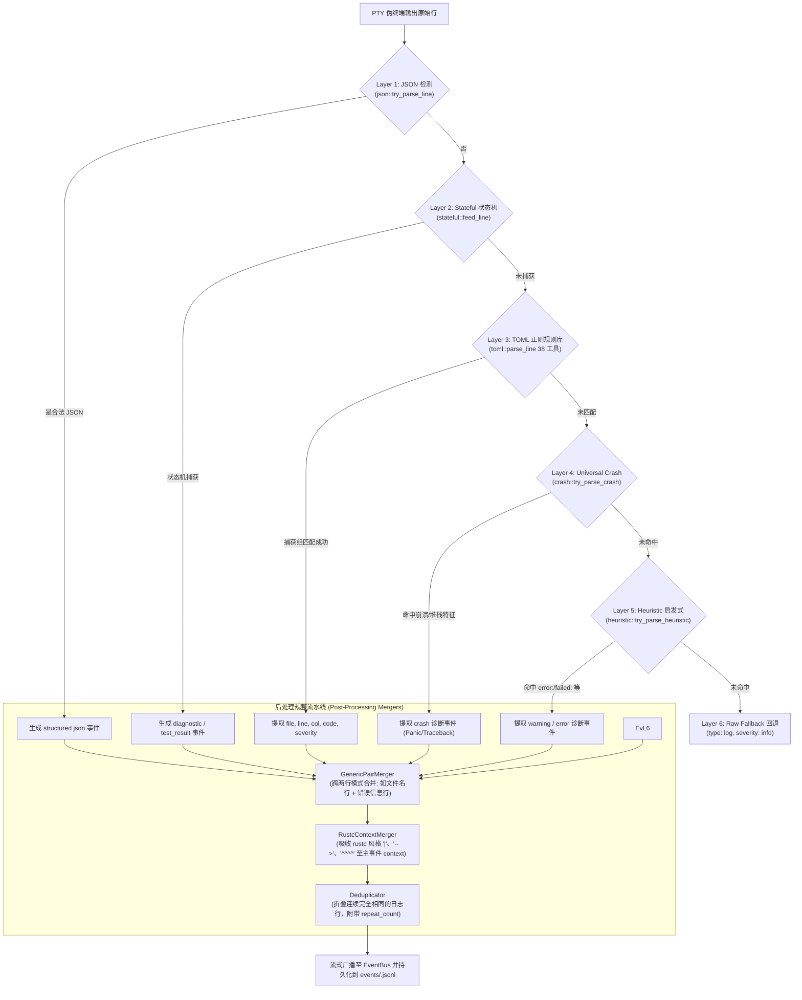
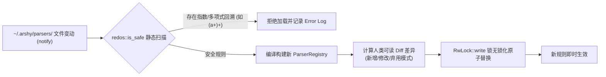

# 专题 03：6 层流式解析流水线与规整器 (Parser Pipeline & Mergers)

本文深入剖析 `arshy` 的 6 层解析漏斗引擎（`src/daemon/parser/`）、38 个生态工具 TOML 规则资产体系、ReDoS 静态正则安全防护机制，以及 Rustc 诊断上下文与连续重复行的后处理规整机制。

---

## 一、 6 层解析流水线与后处理架构

---

## 二、 6 层解析器详解

### Layer 1: JSON / JSONL 原生结构化层
- **逻辑**：以极低的开销尝试将单行按 JSON 解包。如果命令原生输出了 JSON（如 `cargo clippy --message-format=json` 或 `pytest --json-report`），直接解析为结构化事件，避免昂贵无用的正则表达式匹配。
- **源码**：[src/daemon/parser/json.rs](../../src/daemon/parser/json.rs)。

### Layer 2: Stateful 多行状态机解析层
- **逻辑**：针对跨多行的复杂输出（如测试框架的总计表格、多行报错块），维护会话级状态机（`StatefulParser`）。在命令结束时通过 `on_complete(exit_code)` 触发缓冲区最后未落盘的事件。
- **源码**：[src/daemon/parser/stateful.rs](../../src/daemon/parser/stateful.rs)。

### Layer 3: TOML 正则规则库（核心资产，38 工具）
- **逻辑**：项目内置了 38 种生态工具的 TOML 正则规则（Rust `cargo`, TypeScript `tsc`, Python `pytest`, Go `go test`, Docker, GCC, Clang 等）。
  - 规则定义了提取捕获组：`file`（文件路径）、`line`（行号）、`column`（列号）、`code`（错误码）、`severity`（严重等级：error/warning/info）。
  - 在创建 Task Parser 会话时预编译，单行匹配无额外分配开销。
- **源码**：[src/daemon/parser/toml.rs](../../src/daemon/parser/toml.rs) 与规则目录 [parsers/builtin/](../../parsers/builtin/)。

### Layer 4: Universal Crash 崩溃捕获层
- **逻辑**：独立于特定工具的通用崩溃检测器。捕获包括：
  - Rust Panic（`panicked at ...`）
  - Python Traceback（`File "...", line ... in ...`）
  - Go Panic & Goroutine Stack Trace
  - C/C++ 段错误（`Segmentation fault (core dumped)`、`SIGSEGV`、`SIGABRT`）
- **源码**：[src/daemon/parser/crash.rs](../../src/daemon/parser/crash.rs)。

### Layer 5: Heuristic 启发式关键字过滤层
- **逻辑**：针对未编写专门 TOML 规则的未知小众 CLI 工具，通过前缀与关键字启发式规则（如 `error:`, `fatal:`, `FAILED:`, `SyntaxError:`, `Exception:`）将关键错误行从海量普通日志中过滤并提升为 Error/Warning 级别事件。
- **源码**：[src/daemon/parser/heuristic.rs](../../src/daemon/parser/heuristic.rs)。

### Layer 6: Raw Fallback 兜底层
- **逻辑**：未能命中任何规则的普通行，封装为标准 `TaskEvent { event_type: "log", severity: "info", message: line }` 作为保底输出。
- **源码**：[src/daemon/parser/toml.rs:L18](../../src/daemon/parser/toml.rs#L18) (`raw_event`)。

---

## 三、 规整器（Mergers）与去重引擎

### 1. Rustc 诊断上下文吸收器 (RustcContextMerger)
- **痛点**：`rustc`、`tsc` 等现代编译器在报错后会附带多行视觉辅助字符（如 `  |`、`  --> src/main.rs:10:5`、`  |   ^^^^ expected u32`、`  = note: ...`）。如果每一行都作为一个独立的 log 事件发送，不仅会稀释 LLM 注意力，还会占用大量 Token。
- **解决方案**：`RustcContextMerger` 会检测紧随在 Diagnostic 事件之后的所有辅助行，**全部合并吸收进主事件的 `context.after` 数组中**，向 Agent 呈现一个自包含的完整诊断节点。
- **源码**：[src/daemon/parser/mod.rs:L345-L420](../../src/daemon/parser/mod.rs#L345)。

### 2. 连续重复行折叠器 (Deduplicator)
- **痛点**：死循环日志或构建进度条会瞬间打印数万条完全相同的日志行。
- **解决方案**：维护前一行哈希与计数器，连续相同的行仅发射首行，后续行递增 `repeat_count`，避免无谓的 I/O 泛洪。
- **源码**：[src/daemon/parser/dedup.rs](../../src/daemon/parser/dedup.rs)。

### 3. 双行模式合并器 (GenericPairMerger)
- **痛点**：部分工具（如 GCC 旧版本、部分 Linter）第一行打印文件名，第二行打印具体错误信息。
- **解决方案**：通过两行滑动窗口将分离的文件名与错误信息拼接为单条完整 Diagnostic。
- **源码**：[src/daemon/parser/pair_merger.rs](../../src/daemon/parser/pair_merger.rs)。

---

## 四、 规则资产热重载与 ReDoS 静态安全防御

- **ReDoS 静态防御**：在加载任何正则前，静态检查是否存在嵌套量词、可重叠字符集等容易引发指数级回溯的危险模式，确保守护进程免受恶意正则拒绝服务攻击。
- **代码位置**：[src/daemon/parser/redos.rs](../../src/daemon/parser/redos.rs) 与 [src/daemon/parser/loader.rs](../../src/daemon/parser/loader.rs)。

---

## 🔗 相关源码索引
- [src/daemon/parser/mod.rs](../../src/daemon/parser/mod.rs)：6 层解析引擎调度与 RustcContextMerger
- [src/daemon/parser/json.rs](../../src/daemon/parser/json.rs)：Layer 1 JSON 检测
- [src/daemon/parser/stateful.rs](../../src/daemon/parser/stateful.rs)：Layer 2 状态机
- [src/daemon/parser/toml.rs](../../src/daemon/parser/toml.rs)：Layer 3 TOML 正则规则引擎
- [src/daemon/parser/crash.rs](../../src/daemon/parser/crash.rs)：Layer 4 通用崩溃与 Traceback
- [src/daemon/parser/heuristic.rs](../../src/daemon/parser/heuristic.rs)：Layer 5 启发式过滤
- [src/daemon/parser/pair_merger.rs](../../src/daemon/parser/pair_merger.rs)：双行跨行合并器
- [src/daemon/parser/dedup.rs](../../src/daemon/parser/dedup.rs)：连续重复日志折叠器
- [src/daemon/parser/redos.rs](../../src/daemon/parser/redos.rs)：ReDoS 静态正则安全检查
- [parsers/builtin/](../../parsers/builtin/)：内置 38 个生态工具规则库
- **架构决策依据**：[ADR-0006 (注意力编译器与规则资产)](../decisions/0006-value-anchor.md)
