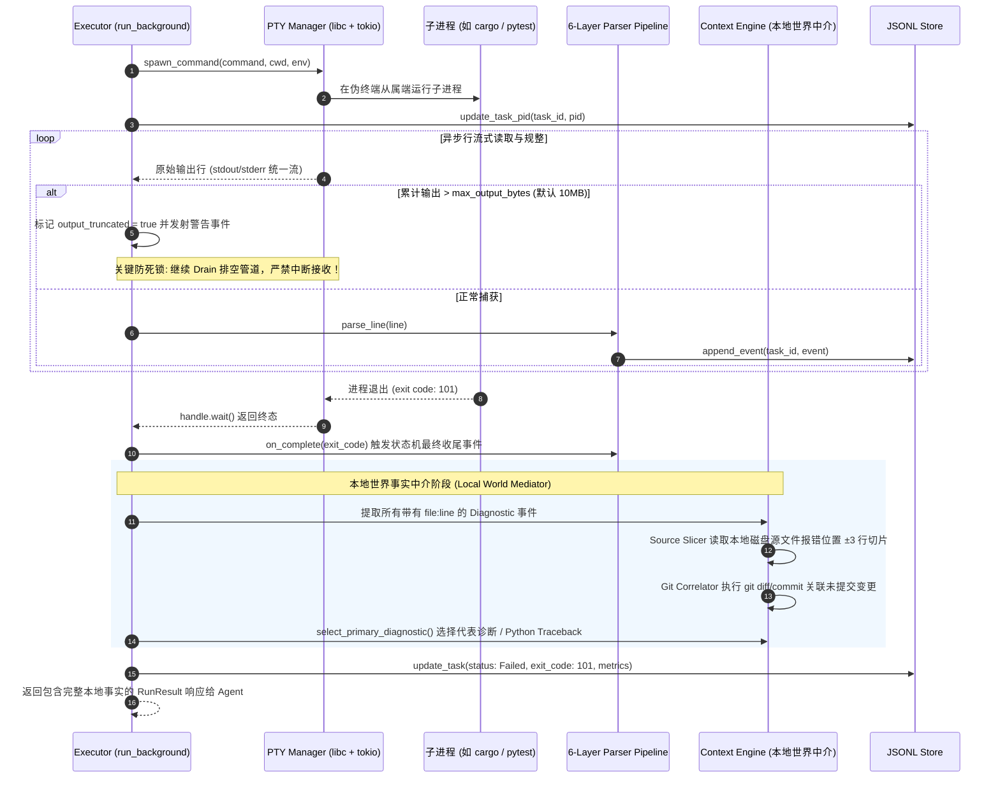

# 专题 04：PTY 进程管理与本地世界中介 (PTY & Context Engine)

本文深入剖析 `arshy` 守护进程如何通过虚拟终端 PTY（`src/daemon/exec/pty.rs`）管理子进程生命周期、防范管道满载死锁、执行三阶优雅终止，以及如何作为“本地世界中介”（`src/daemon/context/`）为报错注入源码切片与 Git 变更关联。

---

## 一、 PTY 执行与上下文增强时序图

---

## 二、 核心业务逻辑与工程细节

### 1. PTY 伪终端的必要性
- **为什么不用标准 `std::process::Command` 管道？**
  - 大量现代编译与测试工具（如 `cargo`, `pytest`, `jest`）在检测到 stdout 是普通管道而非 TTY 时，会**自动退化为块缓冲（Block Buffering）模式**或**关闭色彩与详细报错格式**，导致行事件无法实时流出，甚至丢失关键诊断。
  - 使用 PTY 能让子进程认为自己在一个真实终端中运行，强制保持行缓冲（Line Buffering）并保留原始诊断结构。
- **源码**：[src/daemon/exec/pty.rs](../../src/daemon/exec/pty.rs)。

### 2. 输出截断与防死锁排空机制 (Output Drain Deadlock Prevention)
- **痛点**：若某个命令失控打印了数十万行日志，系统设置了 `max_output_bytes`（默认 10MB）作为保护上限。但如果代码简单地在 10MB 时关闭 `output_rx` 或停止读取，**操作系统的管道缓冲区（通常 64KB）会在几毫秒内被填满**。一旦管道填满，子进程向 stdout/stderr 执行的下一次 `write()` 将被操作系统永久阻塞挂起，导致子进程无法退出、`handle.wait()` 发生死锁。
- **解决方案**：当达到 10MB 阈值后，系统将 `output_truncated` 置为 `true` 并向事件流注入截断警告，**但在后台继续 `recv()` 并丢弃后续数据**，直到子进程正常执行结束退出。
- **源码**：[src/daemon/exec/background.rs:L108-L125](../../src/daemon/exec/background.rs#L108)。

### 3. 三阶优雅终止阶梯 (Kill Hierarchy)
- **机制**：当 Agent 主动取消任务、看门狗超时或守护进程关机时，针对正在运行的子进程执行三阶阶梯式终止策略：
  1. **第一阶：发送 `SIGINT` (Ctrl+C)** ➔ 给予子进程 3 秒优雅清理时间（如保存临时文件、刷新测试结果）。
  2. **第二阶：若仍未退出，发送 `SIGTERM`** ➔ 给予 2 秒标准终止时间。
  3. **第三阶：若仍未响应，强制发送 `SIGKILL` (-9)** ➔ 内核级强杀。
- **源码**：[src/daemon/exec/pty.rs:L200-L240](../../src/daemon/exec/pty.rs#L200)。

### 4. 本地世界事实中介 (Local World Mediator，ADR-0006)
- **哲学公理**：LLM 无法从纯终端输出中推断出本地代码的实际行切片和 Git 变更状态。这些事实必须由工具直接供给。
- **实现组件**：
  - **源码切片提取器 (Source Slicer)**：自动解析事件中的 `file` 和 `line` 字段，读取本地磁盘中对应源文件的 **当前行及前后各 3 行代码（±3 lines）**，附加在 `event.source_context` 中。
  - **Git 关联分析器 (Git Correlator)**：分析当前分支、未提交的本地 Git Diff，并将报错文件与最近一次 Git Commit 进行匹配，判断报错是否是由 Agent 刚刚修改的代码所引发。
  - **代表诊断选择器**：从完整错误事件集合选择一条证据；对于 Python 脚本，选择最后一个完整的 Traceback 异常作为 `primary_diagnostic`，不宣称因果。
- **源码**：[src/daemon/context/mod.rs](../../src/daemon/context/mod.rs)、[src/daemon/context/git_correlator.rs](../../src/daemon/context/git_correlator.rs) 与 [src/daemon/exec/enrich.rs](../../src/daemon/exec/enrich.rs)。

---

## 🔗 相关源码索引
- [src/daemon/exec/background.rs](../../src/daemon/exec/background.rs)：后台 PTY 任务生命周期与防死锁主循环
- [src/daemon/exec/pty.rs](../../src/daemon/exec/pty.rs)：PTY 伪终端创建、管道绑定与三阶优雅退出
- [src/daemon/exec/enrich.rs](../../src/daemon/exec/enrich.rs)：Root Cause 提取与事件切片丰富
- [src/daemon/context/mod.rs](../../src/daemon/context/mod.rs)：本地源码 ±3 行切片提取器
- [src/daemon/context/git_correlator.rs](../../src/daemon/context/git_correlator.rs)：本地 Git 变更分析与关联
- **架构决策依据**：[ADR-0006 (注意力编译器与本地事实中介)](../decisions/0006-value-anchor.md)
