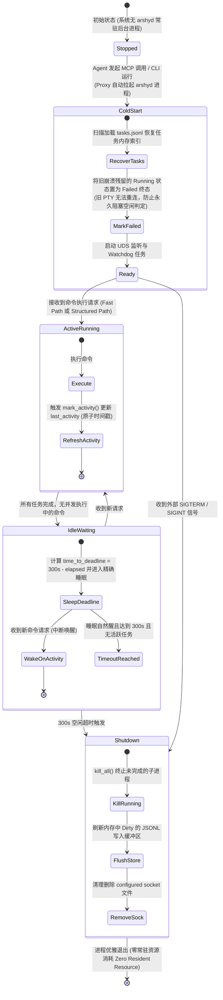

# 专题 05：存储引擎、受限参考表与生命周期 (Store, Reference & Watchdog)

本文深入剖析 `arshy` 守护进程的持久化存储设计（`src/daemon/store/`）、受限错误码参考表与去 HintDb 哲学（`src/daemon/reference/` 与 ADR-0001），以及零轮询的 300 秒空闲看门狗状态机（ADR-0004 & ADR-0007）。

---

## 一、 守护进程状态机与无轮询看门狗

---

## 二、 核心业务逻辑与架构设计

### 1. JSONL 存储设计与规模触发线（ADR-0002）
- **为什么坚持纯文本 JSONL 而不用 SQLite？**
  - **追加写高性能**：构建测试日志为典型的流式追加写入（Append-Only），纯文本 JSONL 具有零额外依赖、极快写入速度与天生的可调试性（开发者可直接 `cat` 或 `jq` 检查）。
  - **文件句柄池复用 (Handle Pool)**：`Store` 内部维护了 `event_files: Mutex<HashMap<String, File>>`。在某个长任务执行期间，文件描述符保持打开，每解析一行直接追加写，**彻底消除了频繁 open/close 文件的系统调用开销**。
  - **规模触发线（Scale Trigger）**：只有当本地历史任务超过 **10,000 条** 或跨任务查询延迟超过 **200ms** 时，才考虑引入派生索引；拒绝过早过度设计。
- **源码**：[src/daemon/store/mod.rs](../../src/daemon/store/mod.rs) 与 [src/daemon/store/tasks.rs](../../src/daemon/store/tasks.rs)。

### 2. 双维度自动轮转淘汰算法 (Pruning Worker)
- **机制**：后台轻量轮转器基于双重阈值定期淘汰历史任务：
  1. **数量维度**：保留最近的 `max_tasks`（默认 1000 条）。
  2. **时间维度**：清理超过 `max_age_days`（默认 7 天）的任务。
  - 淘汰时同步安全删除对应的 `events/<task_id>.jsonl` 文件并回收句柄，防止磁盘膨胀。
- **源码**：[src/daemon/store/prune.rs](../../src/daemon/store/prune.rs)。

### 3. 去 HintDb 化与受限错误码参考表（ADR-0001）
- **背景与哲学纠偏**：
  - 项目在早期曾尝试维护 `HintDb`（试图为各种编译错误生成 cause/fix 建议）。经第一性原理架构审计后，该设计被**坚决彻底废除**。
  - **核心哲学**：生成代码修复建议是 LLM 的职责，Parser 的职责是**提取高精度的客观事实**（位置、错误码、源码切片）。Parser 猜测出来的建议往往刻板且容易误导大模型。
- **受限参考表实现**：
  - 仅针对 Docker 125/126/127/137、Kubectl、AWS 等**非直观的系统级退出码**维护权威参考表（`reference/builtin/*.toml`）。
  - 参考条目仅包含 `code`、`meaning`（客观含义，如 137 表示 OOM Killed）与 `source`（官方文档链接），**严禁包含 cause/fix 建议**。
  - **按需查表，永不内联**：参考表信息绝不写入流式持久化事件，仅在 Agent 通过 `arshy_query` 显式查询时按需附加返回。
- **源码**：[src/daemon/reference/mod.rs](../../src/daemon/reference/mod.rs) 与数据文件 [reference/builtin/docker.toml](../../reference/builtin/docker.toml)。

### 4. 零轮询 300 秒空闲退出看门狗（ADR-0004 & ADR-0007）
- **痛点**：传统守护进程通过每隔几秒的 Timer 轮询检查是否空闲，造成无意义的 CPU 周期唤醒。
- **解决方案**：
  - **全量命令活动追踪**：无论 Fast Path 快速命令还是 Structured 结构化命令，均在入口处通过 `store.mark_activity()` 刷新原子时间戳 `last_activity`。
  - **精确计算单次睡眠**：Watchdog 线程每次计算 `time_to_deadline = 300s - elapsed`，直接让 Tokio 执行单次精确睡眠。若期间有新命令到来则刷新打断，实现完全事件驱动的零轮询。
  - **冷启动崩溃恢复**：冷启动时若发现旧任务仍为 `Running`（上次进程被强杀遗留），立即将其更新为 `Failed` 终态，防止看门狗因“存在运行中任务”而永久无法退出。
- **源码**：[src/daemon/main.rs:L180-L290](../../src/daemon/main.rs#L180)。

---

## 🔗 相关源码索引
- [src/daemon/store/mod.rs](../../src/daemon/store/mod.rs)：Store 存储引擎核心、句柄池与内存缓存
- [src/daemon/store/tasks.rs](../../src/daemon/store/tasks.rs)：tasks.jsonl 读写与崩溃恢复
- [src/daemon/store/events.rs](../../src/daemon/store/events.rs)：events/<task_id>.jsonl 流式追加与过滤分页
- [src/daemon/store/prune.rs](../../src/daemon/store/prune.rs)：双维度 LRU/TTL 存储轮转器
- [src/daemon/reference/mod.rs](../../src/daemon/reference/mod.rs)：受限错误码参考表查询引擎
- [reference/builtin/](../../reference/builtin/)：内置受限错误码数据表 (Docker/K8s/AWS)
- [src/daemon/main.rs](../../src/daemon/main.rs)：守护进程主入口、信号监听与 300s 看门狗
- **架构决策依据**：[ADR-0001 (受限参考表与去 HintDb)](../decisions/0001-restricted-reference-tables.md)、[ADR-0002 (JSONL 存储与触发线)](../decisions/0002-jsonl-retention-and-scale-trigger.md)、[ADR-0004 (空闲退出修复)](../decisions/0004-replay-idempotency-and-execution-safety.md)、[ADR-0007 (按需拉起与事件驱动 Daemon)](../decisions/0007-data-driven-execution-and-on-demand-daemon.md)
