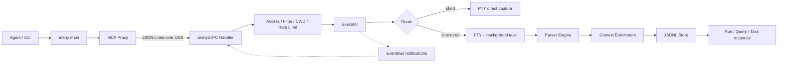

# 源码深读与发布审计工作簿

本文件是 `docs/deep-dive/` 的事实核验层。已有专题文档提供阅读导航，但本文件中的结论必须能回到当前源码、测试或命令输出；发现文档与源码不一致时，以源码和可重复测试为准。

## 当前基线

| 项目 | 当前证据 | 状态 |
|---|---|---|
| 版本 | `Cargo.toml` / `Cargo.lock`: `0.1.0-alpha.1` | 待发布核验 |
| crate 结构 | 一个 library，两个 binary：`arshy`、`arshyd`，一个 integration test target | 已核验 |
| Rust 代码量 | `src/**/*.rs`: 65 个文件、22,945 行 | 已核验 |
| Parser 资产 | `parsers/builtin/`: 38 个 TOML 规则文件；fixture 目录共 120 个文件（60 对），`cargo test fixture_` 执行 37 个 harness | 已核验 |
| 格式检查 | `cargo fmt --all -- --check` | 已通过 |
| 单元测试 | `cargo test --lib --bin arshy --bin arshyd`: 517 + 43 + 2，全通过 | 已通过 |
| 集成测试 | `cargo test --test integration`: 28/28 通过 | 已通过 |
| Clippy | `cargo clippy --all-targets -- -D warnings` | 已通过 |
| 文档构建 | `cargo doc --no-deps --document-private-items` | 已通过 |
| Release build | `cargo build --release` | 已通过 |
| 包内容 | `cargo publish --dry-run --allow-dirty`: 239 files, 1.0 MiB；根目录内部文件已排除 | 已通过（仍需清洁 tag 复核） |
| 安装 dry-run | `bash install/install.sh --dry-run` | 需在发布候选上复验 |
| dogfood | `scripts/dogfood.sh --report`: 28/28 checks passed | 已通过 |
| 质量证据 | [`docs/evidence/2026-09-04.json`](../evidence/2026-09-04.json)，commit `6dfbd4b`；快照记录 dirty files，并含 corpus/platform/sample_size/exclusions | 已生成 |
| dogfood 工具 | `arshy_exec` 未注册，`arshy` 不在 PATH，仓库没有 `scripts/restart.sh` | 发布阻断风险 |
| 工作区 | 存在用户已有修改和未跟踪深读草稿 | 不覆盖、不清理 |

## 真实调用链（以源码为准）



## 章节核验表

| 章节 | 代码重点 | 必须回答的问题 | 状态 |
|---|---|---|---|
| 0 基线 | `Cargo.toml`、发布清单、工作区状态 | 哪个 commit、哪些检查已证实、哪些工具链不可用？ | 初步核验完成 |
| 1 边界与选型 | README、ADR、`src/lib.rs`、入口模块 | 双 binary、Tokio、UDS、JSONL、数据驱动 parser 的实际理由和代价是什么？ | 初步核验完成 |
| 2 黄金链路 | `src/main.rs`、`src/proxy/`、`src/daemon/ipc_handler/`、`src/daemon/exec/` | 短命令和长命令如何从输入变成 MCP 响应？ | 初步核验完成 |
| 3 契约 | `src/mcp/`、`src/ipc/`、`src/proxy/handlers.rs` | schema、request id、错误、通知、重连和重放是否一致？ | 初步核验完成 |
| 4 生命周期 | `src/daemon/main.rs`、`lifecycle.rs`、`bus/` | 启停、空闲、排空、连接上限和取消如何闭合？ | 初步核验完成 |
| 5 安全 | `src/shell.rs`、`security/`、`config/` | 是否所有路径都执行过滤、cwd 守卫、限速和审计？ | 初步核验完成 |
| 6 执行 | `exec/decision.rs`、`pty.rs`、`process.rs`、`background.rs` | Fast/Structured、PTY、超时、kill、TCC fallback 是否无泄漏？ | 初步核验完成 |
| 7 Parser | `daemon/parser/`、`parsers/builtin/`、fixtures | 六层漏斗、合并、去重、热重载、ReDoS 的状态和结束语义是什么？ | 初步核验完成 |
| 8 数据 | `context/`、`store/`、`reference/` | Task/Event 如何写入、恢复、查询、清理和按需提供参考码？ | 初步核验完成 |
| 9 发布面 | `cli/`、`install/`、公开文档 | CLI、指标、安装包和文档是否与实际行为一致？ | 初步核验完成 |
| 10 裁决 | 全部测试与证据 | P0/P1 是否清零，能否给出 Go/No-Go？ | 已执行；工具链阻断发布 |

## 已确认的源码事实

1. MCP 工具映射集中在 `mcp_tool_to_ipc_method`：未知工具直接报错，不会静默执行命令。
2. Proxy 会为 run 请求注入当前工作目录和带 proxy session nonce 的 `dedup_key`；daemon IPC handler 还会维护自己的默认 cwd。
3. `RunResult` 同时承载任务状态、退出码、事件计数、raw output、`primary_diagnostic`、project context 和 raw 字节数。
4. Parser registry 使用 `Arc<RwLock<...>>`，规则来源包含内置和用户文件，并有 watcher 与 ReDoS 校验入口。
5. Store 使用任务表、事件文件、互斥保护和异步 flush；启动时会处理遗留 running task，并支持 integrity/prune/query。
6. Fast Path 仍使用 PTY 做直接输出捕获，但跳过 parser/store/EventBus；它先经过安全检查并持有并发 permit。
7. Structured 后台任务以 `tokio::select!` 竞争输出、超时和 kill；达到输出上限后继续 drain，避免子进程因管道背压而无法退出；parser panic 会被转成 raw fallback 事件。
8. daemon listener 将 Unix socket 设为 `0600`，并用 `peer_cred` 校验 UID；连接数由 64 个 permit 限制。关闭时先移除 socket，再给任务最多 30 秒排空窗口。
9. `tasks.jsonl` 通过临时文件、`sync_all`、rename 原子替换；事件文件通常追加写，增强合并时再进行同样的原子重写。启动恢复会把遗留 `Running` 任务终结，避免阻塞空闲退出。
10. EventBus 使用 4096 容量 broadcast；IPC 连接 outbound 队列为 1024，通知采用 `try_send`，满载时记录 debug 并丢弃，属于明确的 best-effort 流式语义。
11. quality-v1 的百分比在 `src/daemon/store/schema.rs` 中按明确分母计算，分母为零返回 `null`；p50/p99 使用已排序持续时间的离散索引，空样本返回 `null`。快照同时记录 corpus、平台、样本量和排除项。

## 两条黄金调用链的事实矩阵

| 场景 | 关键调用顺序 | 结果/持久化 | 已有证据 |
|---|---|---|---|
| 短命令 `echo` / `rg` | MCP/CLI → UDS → `Executor::run_inner` → rate-limit/filter/cwd → `is_short_command_with_route` → `run_short` → PTY capture | 返回 raw output；不创建结构化事件；活动时间仍刷新 | `run_short_returns_raw_output`、`e2e_efficiency_excludes_short_command_without_structured_events` |
| 长命令成功 | `run_inner` → dedup/single-flight → task record → background PTY → six-layer parser → mergers/dedup → Store/EventBus → completion oneshot | `TaskStatus::Completed`，事件与 metrics 写入 JSONL | `run_long_command_returns_structured_events`、ecosystem integration tests |
| `cargo test` 失败 | rustc/TOML parser 提取 severity/location/code → Rustc context merger → source/git enrichment → `primary_diagnostic` | `Failed` + exit code + diagnostics；不生成 cause/fix | rustc fixture、`e2e_ecosystem_rustc_compile_failure_produces_structured_events` |
| 超时/取消 | select timeout/kill → SIGINT→SIGTERM→SIGKILL → flush mergers → wait/cleanup → update task | `Timeout` 或 `Cancelled`；kill registry 和临时 cwd 清理 | executor timeout/kill tests、`kill_stops_async_task` |

## Rust 知识卡（读代码时的检查点）

- `Arc<RwLock<T>>`：parser/reference registry 共享所有权；读路径只持有短锁，热重载用写锁替换快照。
- `mpsc` 与 `oneshot`：连接 writer 通过有界 `mpsc` 串行化输出；单次运行完成用 `oneshot` 回传，receiver drop 即取消等待而非自动杀进程。
- `tokio::select!`：后台任务把输出、超时、kill 汇合到一个终态收尾路径；每个分支都必须保证 parser flush、store 更新和资源 Drop。
- `Semaphore`：permit 覆盖 Fast 与 Structured 两条路径，防止“快速命令”绕过进程级并发上限。
- `Result`/`?`：协议层将 parse/transport 错误转成 JSON-RPC error；命令本身的非零退出仍属于结构化业务结果。

## 当前发布裁决

技术质量门禁目前为绿：fmt、clippy、unit、integration、doc、release build、package dry-run、installer dry-run 和 dogfood 均通过。最终状态为 **No-Go（工具链阻断）**：AGENTS.md 要求提交前所有 shell/test 走 `arshy_exec`，但本环境中该 MCP 工具未注册、`arshy` 不在 PATH，且仓库没有 `scripts/restart.sh`。恢复 `arshy_exec` 后必须按上方命令重新执行并保存输出；在此之前不应提交或宣称正式发布。

## 重点风险记录

| 编号 | 级别 | 现象 | 证据/复现 | 处理 |
|---|---|---|---|---|
| R-001 | P0 | 发布约定要求所有 shell/test 通过 `arshy_exec`，当前工具未注册且 CLI 不在 PATH | 本轮只能用 Bash 兜底；`scripts/restart.sh` 不存在；虽已用构建二进制完成 dogfood，仍不满足提交政策 | 恢复工具链后重新执行全部门禁，恢复前禁止提交 |
| R-002 | 已处理 | 深读草稿存在失效路径和实现描述偏差 | 已修正 CLI、reference、security、TCC、PTY、socket 和 MCP resource 描述；全文相对链接检查为 0 缺失 | 后续文档改动继续运行链接检查 |
| R-003 | P1/设计接受 | 运行期通知满载时可能丢弃通知 | IPC handler 使用有界 outbound channel 与 `try_send`；reference/ipc.md 已明确 best-effort 语义 | 保留当前行为；补充高负载通知测试或在协议变更时重新评估 |
| R-004 | 已验证 | `exit_code=1` 被视为可能的业务失败而非 MCP transport error | Proxy 单测覆盖 exit 1/2/负数/timeout 与 diagnostics 组合；integration MCP 调用通过 | 保持当前语义，并在新增客户端适配时复核 |
| R-005 | 已处理 | 脏工作区 package 会包含根目录内部文件 | `cargo package --list --allow-dirty` 曾列出 `temporary.md`、`AGENTS.md` | 已在 `Cargo.toml` exclude；clean tag 仍需复核包清单 |
| R-006 | 已处理 | 深读图示曾声称 Fast Path 不使用 PTY | `run_short` 调用 `pty::spawn_command`，只跳过结构化处理 | 已修正专题与工作簿图示；继续以实现调用为准 |
| R-007 | 已处理 | 质量证据脚本未携带 corpus/platform/sample size/exclusions，且 Node 探针可能误走 Fast Path | `docs/evidence/README.md` 的质量契约与脚本输出不完整；短 Node 命令事件数为 0 | 已补齐两类脚本元数据，并给 Node 探针加参数以强制覆盖 Structured Path |

## Rust 学习实验清单

实验代码放在仓库外临时目录，不修改产品实现：

- Serde tagged enum 与 MCP `ContentItem`。
- move、借用和 `Result` 错误传播。
- `mpsc`、`oneshot`、`tokio::select!` 的取消行为。
- `Arc<Mutex<T>>`、`RwLock`、`Semaphore` 的所有权和锁范围。
- 进程组信号、graceful kill 和 Drop 清理。
- parser 多行状态机和末尾 flush。
- JSONL 崩溃恢复、幂等写入和 schema 演进。

每个实验先写预测，再运行，再解释编译器或运行时行为。

## 发布验收命令

工具恢复后按顺序执行并保存完整输出：

```text
cargo fmt --all -- --check
cargo clippy --all-targets -- -D warnings
cargo test --lib --bin arshy --bin arshyd
cargo test --test integration
cargo doc --no-deps --document-private-items
cargo package --allow-dirty --no-verify
bash install/install.sh --dry-run
scripts/dogfood.sh
```

只有全部核心链路有源码与测试证据、P0/P1 风险已处理、公开文档无事实偏差时，才输出 Go；否则输出带复现步骤的 No-Go。
