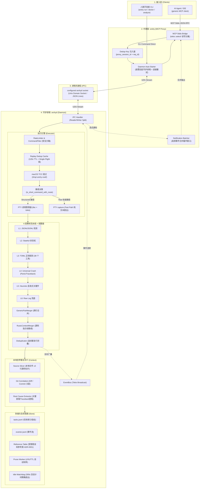

# arshy 核心架构与业务逻辑深度剖析 (Deep Dive)

本文档库专为开发者深入理解 `arshy` 的业务逻辑实现、架构分层与设计决策而建。基于项目当前源码（`src/`）与全部 8 份 ADR 架构决策记录（`docs/decisions/`）整理。

---

## 🗂️ 专题文档导航

```
docs/deep-dive/
├── README.md                          # [当前文档] 专栏介绍与 ADR 对照矩阵
├── 00-master-overview.md              # [全景主文档] 包含全部 6 组架构/时序/状态机图与完整解读
├── 01-proxy-mcp.md                    # 代理层与 MCP 协议栈 (Stdio/Session Nonce/Resources)
├── 02-execution-decision.md           # 执行路径决策与安全沙箱 (Shell AST/TCC 绕过/Fast vs Struct)
├── 03-parser-pipeline.md              # 6 层流式解析器流水线 (TOML 规则/ReDoS/多行规整)
├── 04-pty-process-context.md          # PTY 进程管理与本地世界中介 (管道排空/源码切片/Git 关联)
├── 05-store-reference-lifecycle.md    # 存储引擎、受限参考表与生命周期 (JSONL 句柄池/300s 看门狗)
└── 06-source-audit-workbook.md        # 源码事实核验、Rust 实验与发布 Go/No-Go 工作簿
```

阅读顺序建议先看专题，再以 [06-source-audit-workbook.md](06-source-audit-workbook.md)
逐章回到源码、测试和发布命令核验。专题文档中的路径、图示和结论都不是最终证据；工作簿记录
当前源码基线、已确认事实、待核验问题和发布风险。

---

## 一、 系统全景宏观拓扑图



---

## 二、 ADR 架构决策与源码对照矩阵

| ADR 编号 | 核心决策 | 解决的痛点与依据 (Rationale) | 对应的源码实现位置 |
| :--- | :--- | :--- | :--- |
| **[ADR-0001](../decisions/0001-restricted-reference-tables.md)** | **受限错误码参考表**（彻底废除 HintDb） | 修复建议（Fix/Cause）是 LLM 的职责，Parser 不应越俎代庖；仅将 Docker 137/AWS 等非直观系统退出码含义按需提供。 | [src/daemon/reference/](../../src/daemon/reference/)<br/>[reference/builtin/](../../reference/builtin/) |
| **[ADR-0002](../decisions/0002-jsonl-retention-and-scale-trigger.md)** | **维持 JSONL 存储 + 规模触发线** | 文本追加写、零外部 DB 依赖、高可调试性。设定硬性触发线：任务数 >10k 或延迟 >200ms 才引入派生索引。 | [src/daemon/store/mod.rs](../../src/daemon/store/mod.rs)<br/>[src/daemon/store/prune.rs](../../src/daemon/store/prune.rs) |
| **[ADR-0003](../decisions/0003-ai-native-positioning-and-platform.md)** | **AI-Native 定位与保留人类通道** | 默认作为 Agent 执行后端，同时保留人类 CLI（`arshy run`）与 Pretty 输出。专注于 Unix-like 环境。 | [src/main.rs](../../src/main.rs)<br/>[src/cli/mod.rs](../../src/cli/mod.rs) |
| **[ADR-0004](../decisions/0004-replay-idempotency-and-execution-safety.md)** | **请求重放幂等 + 并发上限 + 空闲修复** | 解决网络重试导致副作用命令双重执行；落地 `max_concurrent_tasks` 信号量；原子记录短命令活跃以修复看门狗。 | [src/daemon/exec/mod.rs](../../src/daemon/exec/mod.rs#L59)<br/>[src/proxy/handlers.rs](../../src/proxy/handlers.rs) |
| **[ADR-0006](../decisions/0006-value-anchor.md)** | **三大价值锚点与三层载体策略** | 注意力编译器 + 本地事实中介（Git/源码切片）+ 社区规则资产；区分轻量检查、重型工具与脚本三层载体。 | [src/daemon/context/](../../src/daemon/context/)<br/>[parsers/builtin/](../../parsers/builtin/) |
| **[ADR-0007](../decisions/0007-data-driven-execution-and-on-demand-daemon.md)** | **数据驱动执行 + 单一职责 MCP** | 区分 Raw Fast Path 与 Structured Path；MCP 明确收敛为 `arshy_exec` / `arshy_query` / `arshy_task` 3 个工具。 | [src/daemon/exec/decision.rs](../../src/daemon/exec/decision.rs)<br/>[src/mcp/](../../src/mcp/) |
| **[ADR-0008](../decisions/0008-prompt-first-agent-onboarding.md)** | **Prompt-First Agent 接入引导** | 避免为每个客户端维护脆弱的 Rust Adapter，通过 `arshy mcp config --format prompt` 输出标准引导让 Agent 自主适配。 | [src/cli/mod.rs](../../src/cli/mod.rs) |
