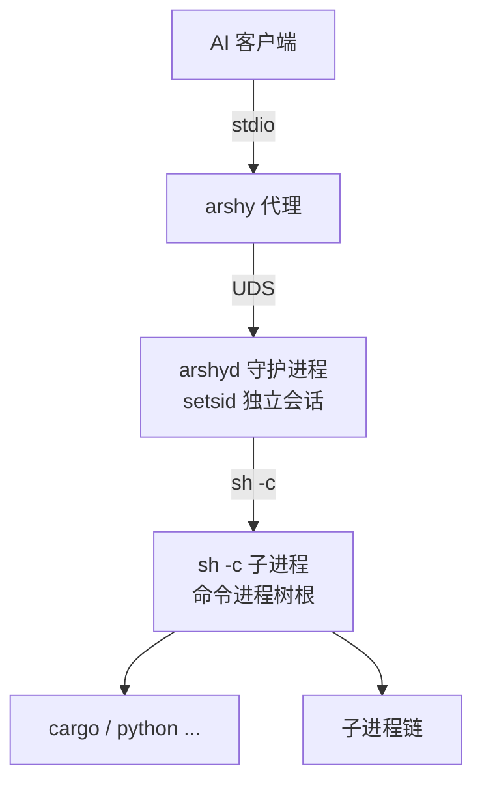

# 系统架构：两个进程，一条执行链

arshy 的架构围绕一个核心判断展开：**命令执行的"价值"与"开销"取决于命令本身，而不取决于调用方式**。短命令（`ls`、`git status`）的价值就是原始输出，任何包装都是浪费；长命令（`cargo build`、`npm test`）的价值在于错误的结构化信息，原始输出反而难以消化。

因此 arshy 不做一个"包一层壳的 bash"，而是一个由两个进程组成的执行层：一个轻量代理负责与 AI 客户端打交道，一个常驻守护进程负责真正执行与结构化。本文解释这两个进程为什么分开、如何通信、各自如何存活，以及命令如何在其中走不同的执行路径。

## 两个二进制，一种职责划分

Cargo.toml 声明了两个二进制目标（`[[bin]]`）：

| 二进制 | 角色 | 主要模块 |
|---|---|---|
| `arshy` | 代理 / CLI | `src/proxy/`（MCP stdio 代理：`mod.rs` + `handlers.rs`/`connection.rs`/`protocol.rs`）、`src/cli/mod.rs`（CLI 命令） |
| `arshyd` | 守护进程 | `src/daemon/main.rs`（启动与接受循环）、`src/daemon/ipc_handler/`（请求分发）、`src/daemon/exec/`（执行引擎） |

`arshy` 是"门面"：它要么作为 MCP server 通过 stdio 与 Claude Code、Cursor 这类客户端对话（`--from-mcp`），要么作为 CLI 接受 `arshy run "..."` 这类命令。它自己**不执行任何 shell 命令**，只把请求翻译成 IPC 协议转发给 `arshyd`。

`arshyd` 是"引擎"：它拥有 PTY 子进程、解析管线、JSONL 存储、事件总线与安全策略。它是唯一真正 `spawn` 命令的进程。

把两者分开的收益是**生命周期解耦**：代理进程的生命周期与客户端绑定（客户端退出它就退出），守护进程的生命周期与"有没有活干"绑定。这样同一个守护进程可以被多个客户端、CLI 调用和 bash 代理共享，任务历史也不会因为代理退出而丢失。

## 通信拓扑：两段协议，一个消息模型

三段链路各有原因：

- **客户端 ↔ 代理（stdio）**：MCP 的 stdio transport 把代理的进程生命周期绑定到客户端进程上，客户端怎么启动、怎么退出，代理就怎么跟着走。代理不需要自己做服务发现或进程管理。
- **代理 ↔ 守护进程（UDS + JSON Lines）**：Unix Domain Socket 让本机任意客户端都能连上同一个守护进程；JSON Lines 逐行帧与 stdio 逐行帧形态一致，代理转发几乎不需要缓冲重组。Socket 默认在 `${XDG_DATA_HOME}/arshy/arshyd.sock`，权限 `0o600`（仅属主可访问，见 security-model）。
- **守护进程 ↔ 命令（`sh -c` 管道）**：命令以 `sh -c "<cmd>"` 子进程方式启动（`src/daemon/exec/pty.rs`），stdout/stderr 由两个异步 reader 逐行送入 channel。注意模块名叫 `pty`，但当前实现是**管道**而非真正的伪终端；`TERM=dumb` 强制工具关闭 ANSI 颜色与光标控制，保证输出逐行可解析。真正的交互式 PTY 输出（`tail -f` 场景）在事件总线上预留了 `StreamOutput` 事件，但没有任何代码路径产生它。

守护进程启动时会探测一次用户的登录 shell 并缓存其 PATH（`user_shell_path()`），这样在 launchd 等最小 PATH 环境下启动的守护进程，依然能找到 `~/.cargo/bin`、homebrew 等目录里的工具。这解释了为什么"通过 arshy 跑的命令"和"在终端里跑的命令"行为一致。

## 代理做了什么

`src/proxy/mod.rs` 的核心是一个 `tokio::select!` 三路循环，同时监听 stdin（客户端请求）、守护进程通知通道（事件推送）、以及 SIGTERM（父进程退出信号）。代理本身不做任何业务判断，但有几个值得理解的设计：

- **通知批处理**：守护进程会推送高频事件（`task/update`、`diagnostic`）。代理把它们放进待发队列，默认每 100ms 或攒满 50 条（`notifications.batch_interval_ms` / `max_batch_events`）合并成**一条** `notifications/message`，payload 是 JSON 数组。高频事件按"窗口"合并而不是逐条转发，直接降低了客户端上下文中的噪音。工具调用完成后还会立即 `drain_pending()` 把剩余通知冲刷出去，保证结果与事件顺序一致。
- **协议版本协商**：MCP 握手时回显客户端请求的版本（支持 2024-11-05 到 2025-11-25 的四个稳定版本），未知版本回退到最早稳定版。注释里记录了一个真实教训：用过期硬编码版本号曾导致真实客户端握手失败。
- **取消传播**：客户端发 `notifications/cancelled` 时，代理用 `request_tasks` 表把 MCP request id 映射回 daemon 的 task_id，并发送 `task/kill`。MCP 的取消语义在代理层被翻译成守护进程的杀任务语义。
- **工具面收窄**：MCP 只暴露两个工具 `arshy_exec`（run/cd/kill/list/tail/subscribe 六种 action）与 `arshy_query`（事件查询）。这是有意的 token 克制，见 design-principles。
- **中间件链**：`Middleware` trait 预留了请求/响应/通知三层钩子（注释提到 AuditMiddleware、RateLimitMiddleware、AuthMiddleware 为将来用途），当前为空链。它是一处"可扩展 > 硬编码"的架构接缝，而不是已实现的机制。

## 守护进程生命周期：按需自启、空闲退出、请求驱动自愈

守护进程不需要用户手动管理，这是整个生命周期设计的出发点。四个机制配合实现"用完即走、需要即在"：

### 1. 按需自启（on-demand auto-start）

`connect_or_start()`（`src/proxy/connection.rs`）先尝试连 socket：连得上直接用；连不上且 `daemon.auto_start`（默认开）时，清理疑似 stale 的 socket 文件，然后 `start_daemon()`：

- **spawn-lock 防重复**：`/tmp/arshyd.spawn-lock` 用 `create_new` 原子创建，写入 PID。若锁已被持有，说明另一个代理正在拉起守护进程，当前调用直接放弃并轮询等待 socket 出现。
- **崩溃熔断**：若 2 分钟内累计 5 次启动/连接失败（`MAX_CRASHES=5`、`CRASH_WINDOW_SECS=120`），自动启动被抑制，返回可读的 `DaemonUnreachable` 错误。这是防止"守护进程 crash-loop、代理疯狂重启它"的自我保命机制。
- **脱离会话**：`setsid()` 让守护进程脱离代理的进程组和控制终端——即使发起者（如 agent 的 shell）先退出，守护进程仍能活到任务结束或空闲超时。
- **二进制解析**：优先找"当前可执行文件同目录下的 arshyd"并用 `canonicalize` 解析真实路径。这条注释解释了为什么：当 arshy 通过 `~/.arshy/bin/bash` 符号链接被调用时，`current_exe()` 返回的是符号链接路径，直接取父目录会找不到 arshyd。
- 启动后以 40 次 × 250ms 轮询等待 socket 就绪。

### 2. 启动重试与存活校验

代理启动时 `connect_with_retry` 最多尝试 5 次（间隔 500ms），每次成功后发一个 `session/cd` 请求验证连接确实可用（"auto-cd validation"）——连接成功不等于协议可用。

### 3. 请求驱动的自愈（self-heal on demand）

如果运行中连接断开（`is_connection_error` 识别 connection closed / timed out / broken pipe / refused / missing socket），代理在 `ensure_daemon_up` 中先冲刷陈旧通知、再以 500/1000/2000ms 退避重连，必要时重新拉起守护进程，然后**把当前请求重放一次**。对 agent 来说，一次连接抖动表现为"稍慢的请求"，而不是一次失败。`tools/call`、`resources/list`、`resources/read` 都走这个恢复路径。

### 4. 空闲退出（idle-exit）

`src/daemon/main.rs` 的接受循环里有一个看门狗分支：默认空闲阈值 900 秒（15 分钟，`idle_timeout_secs`，0 表示禁用），轮询间隔取阈值的一半（上限 60s、下限 5s）。空闲定义为"没有运行中的任务，且最近完成的任务也早于阈值"（`store.idle_since_secs()`）。这样 IDE 关闭、代理退出后，守护进程不会永远躺在内存里——它是有状态的服务，但只在被需要的时间窗口内存在。

### 5. 优雅关闭

关闭路径分三阶段（`src/daemon/main.rs`）：

1. 广播 `daemon/shutdown` 通知（30s 宽限期），立即删除 socket 拒绝新连接；
2. 先给运行中任务 5 秒自然完成；超时后 `executor.kill_all()`，硬截止 30 秒后强制退出；
3. flush store、删 PID 文件、删 socket。

代理收到 SIGTERM 时也会尽力向守护进程发一次 `daemon/shutdown`（best-effort），让"客户端退出"这个最常见的场景把守护进程也带走。

## 两种执行路径：短命令直通 vs 长命令结构化

`src/daemon/exec/mod.rs` 把执行分成三种模式：`sync`（等到底）、`async`（立即返回 task_id）、`auto`（默认，智能选择）。**auto 模式是 arshy 对"什么时候值得结构化"的答案**：不值得结构化的命令一分钱都不花，值得结构化的命令一次调用给全。

### 短命令判定（`is_short_command`）

| 规则 | 判定为"长" |
|---|---|
| 语法 | 含 `>>`、`&&`、`||`、`&`（`|` 单独允许，≤5 词 ≤80 字符的简单管道仍走短路径） |
| 长跑信号 | 含 `--watch`、`-f`、`serve`、`daemon`、`start`、`dev`、`preview` 等标志/子命令 |
| 工具 | 命中 build/test 前缀表（cargo test/build/clippy、npm run、pytest、tsc、make、go test 等 40+ 前缀，含 `python -m pytest` 这类三词前缀和 `./node_modules/.bin/tsc` 这类路径调用） |
| 兜底 | 超过 80 字符或超过 5 个词 |
| 例外 | 只读检查工具表（echo、cat、ls、git status/log/diff 等）**永远**走短路径——它们的原始文本比事件流更有用 |

注意判定顺序：长跑标志和长输出前缀的优先级高于长度兜底；检查工具表的优先级最高。路径式调用（`./node_modules/.bin/tsc`）按 basename 匹配，否则 bin-path 调用会全部漏进短路径、解析器永远不运行——这是一个被测试专门覆盖的回归点。

### 短路径：零开销直通

`run_short()` 直接 spawn、等待、把合并后的 stdout+stderr（`_source` 标签被有意忽略，保证 `git push` 失败时的 stderr 诊断也出现在输出里）作为 `raw_output` 返回。它**跳过** store 插入、parser session 和 EventBus——这三个都是为结构化服务的。但两条例外很关键：**安全过滤和审计日志不跳过**（见 security-model 的"安全默认非可选"）。超时处理也存在：超时则 `force_kill` 并返回 timeout 状态。

### 长路径：结构化全流程

长命令走完整链路：

1. 工具检测：`parser.detect(command)` 从 37 个内置 TOML 解析器 + 用户解析器中选出工具（`parse_hint` 可强制指定）；
2. 创建 task（uuid task_id，写入 store，状态 running），spawn 后台执行任务；
3. 输出逐行进入 6 层解析管线（见 parser-pipeline），事件去重、合并、存入 JSONL、发布到 EventBus；
4. **auto 的同步耐心窗口是 60 秒**：命令在 60 秒内结束，则同步返回完整结构化结果；超过 60 秒，降级为 async——返回 `task_id` 和 `running` 状态，任务继续在守护进程里跑，agent 可以 `arshy_query`、`arshy kill` 或订阅；
5. 完成后计算 root cause（第一个 error 事件，traceback 场景取最后一个诊断错误）、project context（`git diff --stat HEAD~1` + 错误文件与最近变更文件的关联）、±3 行源码上下文并回写 store；
6. 响应里内联事件按结果裁剪：失败最多 20 条 error 事件，成功最多 5 条 warning/info 事件，超出部分用 `events_truncated` + `events_hint` 告诉 agent "去 `arshy_query` 取全量"。

显式 `sync` 模式没有 60 秒耐心窗口（调用者选择了阻塞）；显式 `async` 立即返回。任何 `parse_hint` 都会强制走结构化路径——调用方声明了期望格式，就按结构化兑现。

### 为什么短命令不"顺便"结构化？

因为结构化有真实成本：store 写入、解析 session、事件流、去重合并，以及最重要的——**输出给 agent 的形态变化**。`echo hi` 的价值就是那两个字；把它变成一条 JSON 事件反而制造噪音。短/长分界本质上是对"解析收益 > 解析成本"的显式建模，而不是实现妥协。

## 进程树与信号语义

- 每个命令是 `sh -c` 的一个子进程，工具派生的孙进程构成命令进程树；
- `kill_on_drop(true)` 保证守护进程死亡时子进程不被遗弃；
- 杀任务用信号升级：`SIGINT →（等 3s）→ SIGTERM →（等 2s）→ SIGKILL`，每步同时向进程组（负 PID）与直接 PID 发送信号，以覆盖管道与 fork 出的子进程链；
- 短路径与长路径共用同一套 spawn/读取/杀灭机制，只是跳过解析层。

## 一个特殊适配：macOS TCC

`src/daemon/exec/cwd.rs` 处理了 macOS 的 TCC（Transparency, Consent, and Control）：TCC 会限制 PTY 子进程访问 `~/Documents`、`~/Desktop`、`~/Downloads` 等目录，即使父进程（守护进程）有权写入。解决方案是在 `/tmp/.arshy-cwd/<hash>` 建一个指向真实目录的符号链接作为子进程 cwd（符号链接继承其父目录 `/tmp` 的权限），并向环境注入 `ARSHY_CWD` 让命令知道真实路径。这是一个平台性适配，不是安全沙箱的一部分（见 security-model 的边界声明）。

## 关键取舍

| 取舍 | 选择 | 原因 |
|---|---|---|
| 一个进程还是两个 | 两个 | 生命周期解耦：代理随客户端生死，守护进程按需独立存活 |
| 代理做业务吗 | 不做 | 代理越薄，越不容易与客户端协议绑定；业务全在守护进程，单一职责 |
| 短命令结构化吗 | 不 | 解析收益小于成本；原始文本对只读工具最有用 |
| 长命令同步还是异步 | 先同步 60s，再降级异步 | 大多数构建在 60s 内结束，一次往返拿到结果最省事；超长任务不阻塞调用方 |
| 守护进程何时退出 | 空闲 15 分钟 | 有状态服务 + 按需存在，避免常驻资源占用 |
| 连接抖动怎么办 | 自动重连 + 请求重放 | 对 agent 表现为延迟而非失败 |
