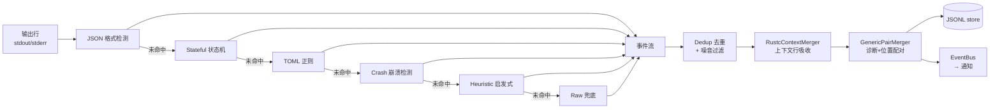

# 解析管线：从字节流到事件流

长命令的原始输出是"一行一行的人类文本"，而 agent 需要的是"哪里错了、错码是什么、上下文长什么样"。解析管线就是这两者之间的转换层：它把 stdout/stderr 的每一行流式地变成结构化事件（`TaskEvent`），再经过后处理与增强，最终成为可查询的执行记忆。

管线设计有一个明确的覆盖目标（写在 `src/daemon/parser/mod.rs` 头部）：**70% 的行由 TOML 正则层处理，25% 由状态机层处理，5% 落入 crash/raw 兜底**。这个比例不是统计出来的，而是对"工具输出多大程度可预测"的假设：大多数构建工具的输出是稳定的格式（正则就够了），少数需要跨行状态（npm、webpack 的块状错误），极少数是未知崩溃（交给通用模式）。

## 管线总览

每一行按优先级依次尝试各层，**先命中者胜**。这个顺序本身就是设计判断：格式检测（JSON）确定性最高、收益最大，所以最优先；工具特定的正则其次；通用的崩溃/启发式模式再次；最后永远有一个 raw 兜底，保证任何一行都不会让管线卡死。

## 六层逐一解释

### 第 1 层：JSON 格式检测

结构化输出（JSON、NDJSON、YAML、CSV）不需要正则猜测——它本身就是结构。因此这一层有两个触发点：

- **逐行**：以 `{` 开头的行尝试按 JSON 对象解析，成功则直接转成事件（`type`/`level` 字段映射为 `event_type` 与 `severity`）；
- **命令结束时整体**：累计的完整输出依次尝试"整体 JSON（对象/数组）→ NDJSON（≥80% 行是合法 JSON 对象）→ YAML（`---` 开头或 key: value 模式）→ CSV/TSV（一致的分隔符模式）"，一旦命中就生成事件并**跳过正则管线**（`try_parse_json`）。

整体探测放在完成时而非逐行，是因为 JSON 常跨多行；这是"格式检测"与"正则解析"的收益权衡——前者一次成批，后者逐行流式。

### 第 2 层：Stateful 状态机

有的工具输出是跨行的块状结构：npm 的 error block、webpack 的 chunk 信息——单行正则看不到全貌。状态机层用 `state_condition`（仅在状态满足时匹配）和 `state_transition`（匹配后改写状态）表达这类上下文依赖。命令结束时调用 `on_complete`，让状态机有机会基于退出码和累积状态补发最终事件。

状态机层不命中时会**落入下一层**而不是直接 raw——它只处理它认识的块。

### 第 3 层：TOML 正则（主战场）

38 个内置解析器（`parsers/builtin/*.toml`）各自是一组正则模式：每个 `[[pattern]]` 声明 `regex`、`event_type`、`severity` 和 `fields`（字段 → 捕获组编号的映射，支持 `file`/`line`/`column`/`code`/`message`，甚至 `severity` 也可以从捕获组动态取值）。模式按声明顺序匹配，**第一个命中的赢**。

这一层之所以是主战场，是因为它数据驱动：添加一个工具的输出格式不需要改 Rust 代码，写一个 TOML 文件即可（见 design-principles 的"可扩展 > 硬编码"）。解析器选择由工具检测决定：`[meta]` 里的 `detect`/`detect_full` 模式匹配命令文本，`min_version`/`max_version` 约束工具版本，`priority` 排序，同名用户解析器覆盖内置解析器。

### 第 4 层：Crash 崩溃检测（通用、无工具依赖）

语言级崩溃模式跨工具一致，不值得为每种工具各写一遍。内置的静态模式表覆盖 Go panic（`main.go:42 +0x1234`）、Python traceback（`File "app.py", line 42` 与显式列出的几十种内置异常类型）、Rust panic（`thread 'main' panicked at ...`）、Node.js（`Error:` 与 `at func (file.js:42:10)` 栈帧）、shell 段错误/信号。产出 `crash` 类型事件，`code` 字段标记语言（`go`/`python`/`rust`/`node`/`shell`）。

注意 Python 异常模式放在 Node.js 之前匹配，避免 `ValueError` 之类被泛化 `\w*Error` 误判——层内顺序同样承载语义。

### 第 4.5 层：Heuristic 启发式错误过滤

工具特定解析器没认出、又不属于崩溃签名的行，如果含有错误/警告关键字，很可能就是"没被结构化的错误"。这层用通用模式抓取：

- `file:line:col: error` / `file:line: error`（GCC/rustc/clippy 风格）→ 提取 location；
- 独立关键字：`fatal error`、`FAILED`、`panic`、`traceback`、`segmentation fault`、`killed`、`Error:` 等；
- 警告同类：`file:line: warning` 与 `warning`/`deprecated` 关键字。

这层最在意**误报**：测试明确要求 `Implement proper error handling for this module` 和 `error handling utilities` **不得**命中——`error` 后面必须跟冒号/方括号才匹配，自然语言里的 "error handling" 不是错误。

### 第 5 层：Raw 兜底

任何未命中的行都变成 `log` 类型事件，`severity` 由通用分类器决定：行内含 `error`/`fatal`/`failed`/`panic`/`traceback`/`segmentation fault` 等归为 error；含 `warning`/`warn`/`deprecated`/`notice` 归为 warning；否则 info。分类器还识别 `e ` / `w ` 前缀（部分工具的错误行前缀）。raw 兜底保证管线**永远有输出**——解析是增强，不是把关。

## 事件模型：TaskEvent

所有层最终产出同一个结构（`src/ipc/mod.rs`）：

| 字段 | 含义 | 说明 |
|---|---|---|
| `seq` | 任务内序号 | 由执行器统一分配 |
| `type` | 事件类型 | `log`（raw 兜底）、`diagnostic`（诊断）、`location`（位置行）、`crash`、`summary`、`test_result`、`system` 等 |
| `severity` | 严重度 | `error` / `warning` / `info`（可选） |
| `code` | 错误码 | 如 `E0425`、语言名（crash 层） |
| `message` | 消息文本 | 通常来自捕获组或整行 |
| `location` | 位置 | `{ file, line, column? }`（可选） |
| `context` | 源码上下文 | `{ before[], line, after[] }`（可选） |
| `hint` | 提示 | **恒为 null 兼容占位**，见下文"为什么不做 cause/fix" |

事件持久化为 `events/<task_id>.jsonl`（每行一个 JSON 事件），查询时默认**排除 log 事件**（`include_logs=false`）——原始行不是 agent 想要的东西，结构化事件才是。

## 后处理三兄弟：去噪、合并、配对

解析层产出的事件流并不直接可用，还有三个流式后处理器，各有明确动机：

### Deduplicator：折叠连续重复

构建工具经常把同一行刷屏（下载进度、重复警告）。去重器跟踪"连续且 event_type + message + location 相同"的事件，折叠成一条并追加 `(repeated N times)`。同时承担噪音过滤：空白行、纯 ANSI 行、孤立的 `:` 在存储前丢弃；ANSI 转义序列（SGR 颜色码）被剥离——`TERM=dumb` 是执行侧的预防，这里是解析侧的兜底。值得注意它只折叠**连续**重复：`+`/`-`/`{`/`}` 等字符在 diff/JSON 输出里是合法内容，不做全局过滤。

### RustcContextMerger：把上下文行吸收进诊断

rustc 风格的诊断会把 `= note:`、`= help:`、`  |` 管道标记、`N | 源码行`、`^^^` 光标标记作为独立行输出。这些行单独成事件是噪音——它们只对前一条诊断有意义。合并器把它们缓冲并附加到前一条 diagnostic 的 `context.after`，同时过滤纯装饰行（空管道、纯 `^^^`/`---`、`-->` 箭头、ANSI 时间戳、孤立 `}`）。结果：一次"mismatched types"错误在事件里是一个带源码上下文的诊断，而不是五六条碎片事件。

### GenericPairMerger：诊断与位置配对

cargo 和 Python traceback 常把"错误消息"和"位置行"分成两个相邻事件（`--> src/main.rs:5:10` 与它前面的 error 行）。配对合并器把 diagnostic + location（或反向 location + diagnostic）合并为**单个带 location 的诊断**，中间夹杂 log/summary 也不影响配对。

这三个后处理器共享同一个理念：**事件的价值在结构，不在行数**。合并是 token 克制的手段之一——它让"一个错误"在数据里就是一个事件。

## 完成时处理

输出流关闭后（进程退出），管线还有几个收尾动作：

1. **整体 JSON 探测**（见第 1 层）；
2. **stateful `on_complete`**：状态机基于退出码补发最终事件；
3. **任务状态判定**：退出码 0 → completed；非 0 → failed；超时 → timeout；被杀 → killed；
4. **raw output 落盘**：完整原始输出存 `raw/<task_id>.txt`，供 `tail` 和失败恢复使用；
5. **事件统计**：去重折叠数、配对合并数、与 git 关联的错误数都记入任务计数器——这些数字本身是管线质量的观测数据。

## 上下文增强：±3 行源码与 git 关联

`src/daemon/context/mod.rs` 与 `src/daemon/context/git_correlator.rs` 在事件流定型后做最后一轮增强：

- **±3 行源码上下文**：对带 location 的 error/warning 事件，异步读取源文件，取错误行前后各最多 3 行组成 `context.before`/`context.after`/`context.line`。文件读取带缓存（同一文件多个错误只读一次），越界或读不到文件静默跳过——增强失败不影响事件本身。
- **git 变更关联**：`git diff --name-only HEAD~1` 得到"最近一次提交以来变更的文件"；`correlated_errors` 标记每个错误事件的文件是否在变更集内，`git diff --stat HEAD~1` 进入失败任务的 `project_context`。这回答了一个 agent 最常问的问题："这个错误是不是我刚改出来的？"
- **primary diagnostic 选择**：失败时从完整 error 事件集合选择一条代表证据；Python traceback 的横幅不是有用诊断，因此该场景取最后一个 diagnostic error。这个字段不宣称因果。

增强结果通过 `merge_enriched_events` 回写 store（保留原有 log 事件），随后 agent 无论从内联事件还是 `arshy_query` 拿到的都是增强后的版本。

## 为什么不做 cause/fix 合成

这是管线设计中最刻意的克制，代码注释直言不讳：**arshy 的职责是结构化提取——severity、file:line、错误码、源码上下文——而不是建议**。曾经存在的 HintDb（错误码 → cause/fix/retry 映射表，`parsers/errors/*.toml`）已被移除：

- 失败的原始输出已经"自己会说话"，arshy 只负责指出错误**在哪**；
- 解释错误、给出修复方案是 LLM 的工作——它比任何静态映射都更了解项目的上下文；
- 静态 hint 表会过期、会与项目状态脱节，却以"权威"姿态出现在结构化数据里，误导性最强。

`TaskEvent.hint` 字段保留但恒为 null 兼容占位，正是为了保持"结构清晰、内容克制"：协议上留了这个槽位，语义上不填。

## 质量机制：数据驱动与可度量

- **TOML schema 自校验**：解析器定义加载时，正则先过 ReDoS 静态检查（拒绝嵌套量词、重叠分支+重复等灾难性回溯模式），危险正则根本进不了运行时；
- **热重载**：文件监听器（notify）在解析器文件变更时重载 registry 并输出 diff，无需重启守护进程；
- **Fixture 测试**：每个内置解析器配 `.txt` 输入与 `.json` 期望输出（60 组 fixture），`ARSHY_BLESS=1` 可重新生成期望；
- **Benchmark**：内置基准在 fixture 上度量结构化事件质量、字段密度和未解析错误行数；它不估算 token，也不产出通用的节省率。

## 权衡总结

| 权衡 | 选择 | 原因 |
|---|---|---|
| 逐行流式 vs 整体解析 | 两者都要 | 流式支持实时事件与超长输出；整体 JSON 探测补足跨行结构 |
| 正则优先 vs 状态机优先 | 状态机在前 | 状态机依赖顺序，先让它消费它认识的块；单行正则其次 |
| 工具特定 vs 通用 | 工具特定为主，通用兜底 | 精确度优先（70% 目标），通用层保证覆盖面 |
| 合并 vs 原样保留 | 合并后原样可查 | 展示用合并（少 token），`raw/<id>.txt` 保留原始输出兜底 |
| 上下文增强失败 | 静默跳过 | 增强是锦上添花，不能因为读文件失败破坏事件流 |
| hint/cause/fix | 不做 | 结构与建议分开，建议是 LLM 的职责 |
