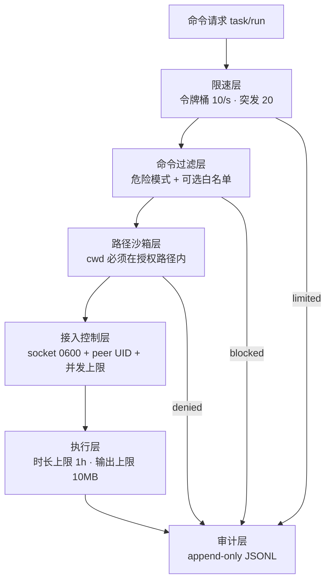

# 安全模型：纵深分层，边界诚实

arshy 的安全设计从威胁模型出发，而不是从功能清单出发。它的职责是"为 AI agent 执行任意 shell 命令"，因此威胁不是理论上的黑客，而是三类非常现实的场景：**恶意命令**（prompt injection 或 agent 被诱导执行破坏性操作）、**失误命令**（agent 写错参数、删错路径）、**越权路径**（绕过工作区边界访问不该访问的位置），外加一类资源问题：**失控循环**（agent 疯狂重试、命令长期运行）。

安全模型是**分层**的：每一层挡住一类威胁，层与层独立失败（任何一层拒绝，命令就不执行）。同时它明确声明自己不做什么——它不是容器、不是 VM，不承诺对抗有意的系统逃逸攻击。

## 防线总览

所有层都挂在 `Executor::run()` 的入口，且**无论短命令还是长命令都执行**——`run_short` 跳过的只有 store、解析器、事件总线（可选增强），限速、过滤、沙箱、审计一条不落。

## 威胁一：恶意/失误命令 → 命令过滤

`src/daemon/security/filter.rs` 的 `CommandFilter` 用一组默认正则拦截高危模式（`src/config/schema.rs` 的 `default_blocked_patterns`），按威胁类别组织：

| 类别 | 拦截示例 |
|---|---|
| 文件系统破坏 | `rm -rf /`、`rm -rf ~/`、`dd if=`、`mkfs` |
| shell 注入 | `curl ... \| sh`、`wget ... \| sh`、`\| sh`、`base64 -d \| sh`、`eval $(...` |
| 提权 | `sudo rm -r/-f`、`sudo dd/mkfs/fdisk/parted`、`sudo chmod 777`、`sudo su`、`su -` |
| 凭据窃取 | `cat ~/.ssh/id_rsa` 等、`/proc/<pid>/environ` |
| 网络滥用 | `nc -l`、`ncat -l` |
| 危险权限 | `chmod 777` |
| 拒绝服务 | fork bomb（`:(){ :|:& };:`） |

**混淆变体是被显式测试的**（`blocked_rm_rf_obfuscated_variants`）：`rm -rf -- /`（选项终止符）、`rm --recursive --force /`（长选项）、`rm -rf "/"`（引号）、`rm${IFS}-rf${IFS}/`（IFS 变量注入）全部命中。这类模式是"正则识别意图"的尽力而为——它挡的是显而易见的破坏，不是加密后的指令。

过滤器的第二模式是可选**白名单**（`allowed_commands`）：启用后按命令首词（剥离路径的 basename）比对，不在列表内一律拒绝。白名单是"最小权限"模式，默认关闭。

被拦截的命令会带原因写入审计日志（`blocked: true` + 命中的模式），保证"拒绝"本身可追溯。

## 威胁二：越权路径 → 路径沙箱

`src/daemon/security/sandbox.rs` 的 `check_path` 约束命令的工作目录：`cwd` 必须在 `sandbox_paths` 之一内部。三个实现细节对应三类逃逸：

- **`../` 逃逸**：双方都 `canonicalize()` 后比较前缀，`inner/..` 解析后不在沙箱内 → 拒绝；
- **符号链接逃逸**：沙箱内的 symlink 指向外部目录，canonicalize 解析真实路径后同样拒绝；
- **不存在的路径**：无法 canonicalize 的 cwd 直接拒绝（fail-closed）。

`~` 会被展开；`sandbox_paths` 为空时检查跳过（宽松默认）。

沙箱有显式的**workspace 模式**（`daemon.sandbox_mode = "workspace"`）：守护进程启动时把自身当前目录锁为唯一沙箱路径。这相当于"这个 daemon 只服务它启动时所在的工作区"。注意：这是**启动时快照**——cwd 是启动瞬间的，不是每次请求重新探测的。

沙箱模式的取值在守护进程启动时严格校验（`src/daemon/main.rs`）：只接受 `none` 或 `workspace`，其他值直接启动失败并给出错误。**配置错误 = 拒绝服务**，而不是带病运行。

## 接入控制与资源防护

守护进程在"谁可以连、连多少"上也有限制：

- **Socket 权限 `0o600`**：只允许属主读写；
- **peer UID 校验**：每次 accept 后读对端凭据（`peer_cred()`），UID 与守护进程不同即拒绝——这是 Unix 域的"同用户"信任边界；
- **并发连接上限**：64 个并发连接的信号量，防资源耗尽（正常 MCP 代理只用 1–2 个连接）。

资源防护针对"失控循环"这类 agent 特有威胁：

- **限速**：令牌桶默认 10 命令/秒、突发 20（`rate_limit`），超限返回 `RATE_LIMITED` 错误。注释点明动机："prevents agent loops from exhausting system resources"——agent 的重试循环是真实事故源；
- **单任务时长**：默认上限 1 小时（`max_task_duration_ms`），超时强制杀灭并标记 `timeout`；
- **单任务输出**：默认上限 10MB（`max_output_bytes`），超限截断并发出 `system` 级 warning 事件——输出本身不会拖垮内存；
- **杀灭分级**：`SIGINT → SIGTERM → SIGKILL` 信号升级，每步打进程组覆盖整个子进程树（见 architecture 的进程树一节）；
- **解析器正则 ReDoS 校验**：TOML 解析器加载时静态检查灾难性回溯模式（嵌套量词、重叠分支+重复），拒绝进入运行时。这是对"数据驱动扩展"的护栏：用户写的正则不能打垮守护进程。

## 审计日志：append-only 的完整记录

`src/daemon/security/audit.rs` 是 JSON Lines 的 append-only 文件（配置 `security.audit_log` 开启）。每条记录包含：时间戳、task_id、命令原文、cwd、退出码、`blocked` 标志与拒绝原因。

两条设计要点：

- **拦截与放行都记录**：blocked 命令带原因入库，正常命令带退出码入库——审计回答"发生了什么"和"什么被阻止了"两个问题；
- **短路径同样记录**：`run_short` 的注释明确"Security checks and audit logging still apply"。最快的路径也不能绕过审计。

## 权限分级：read-only 模式

守护进程有一个 `access_level`（"full" / "read-only"）：read-only 下 `METHOD_RUN` 与 `METHOD_KILL` 一律返回 `ACCESS_DENIED`，其余（query/list/status/stats）照常。这是"只读巡检"场景的硬开关——不是软提示，是执行层的强制。

## 安全默认，非可选

把上面所有层连起来看，安全默认的"非可选"体现在三个层面：

1. **执行路径固定**：限速 → 过滤 → 沙箱是 `run()` 的开头固定代码，任何调用方式（MCP、CLI、bash 代理）都经过同一入口；
2. **性能优化不碰安全**：短路径可以跳过结构化（见 architecture），不能跳过安全——两条路径的差异被刻意限定在"可选增强"范围内；
3. **配置 fail-closed**：非法 sandbox_mode 拒绝启动；路径无法解析拒绝执行；peer UID 不匹配拒绝连接。

## 边界：明确不做什么

安全模型最诚实的部分是它的边界声明：

- **不是容器/VM 沙箱**：命令仍以用户身份在真实系统里运行，具备用户的全部权限。`sandbox_mode` 注释里 `process`/`container` 是保留值，未实现——不要把它当成隔离执行环境；
- **过滤是正则，不是语义执行**：命令过滤识别"明显危险的字面模式"，挡不住经过深度混淆的指令。它防的是失误与常见恶意模式，不是有意的逃逸攻击；
- **TCC 符号链接是兼容性适配，不是安全机制**：`/tmp/.arshy-cwd/<hash>` 绕过 macOS TCC 是为了让命令能访问用户的 Documents/Desktop，它扩大而非缩小了访问面；
- **威胁模型是"同用户"的**：peer UID 校验挡的是"别的用户连我的 daemon"，不挡"我自己机器上的恶意进程"——同用户下任何进程本来就有同等权限。

一句话总结：arshy 的安全目标是**把 agent 的失误与明显恶意挡在门外、把一切行为记录在案**，并诚实说明它不替代操作系统级隔离。在这个边界内，每一层都有明确归属的威胁、明确的失败模式，和"宁可拒绝，不可放过"的默认值。
